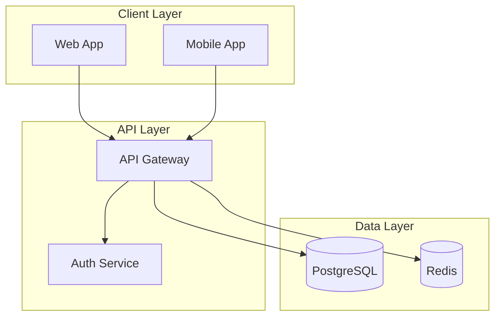
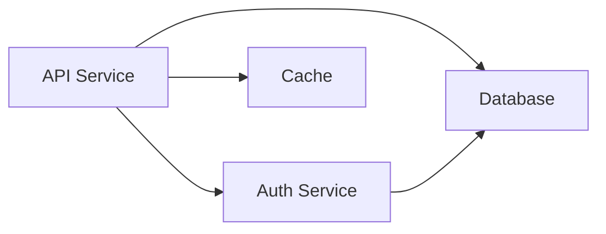
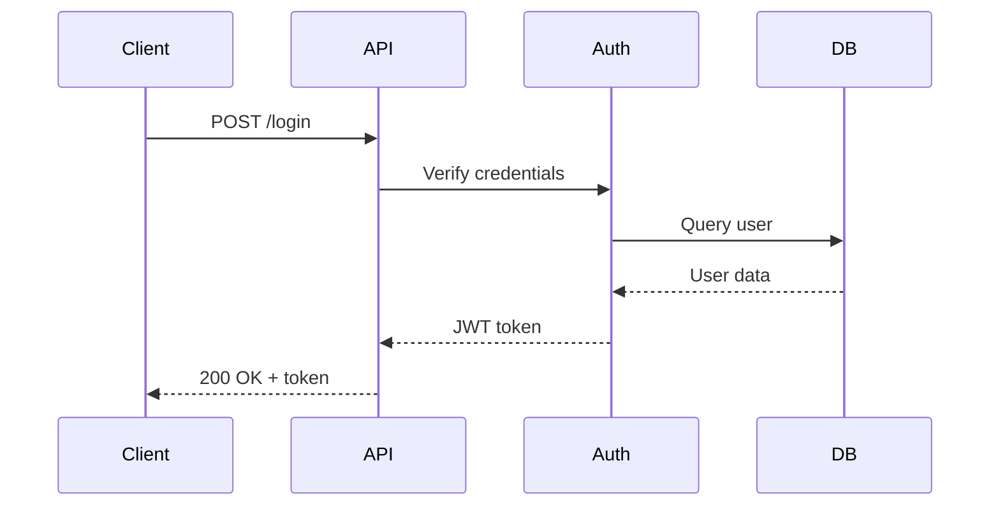
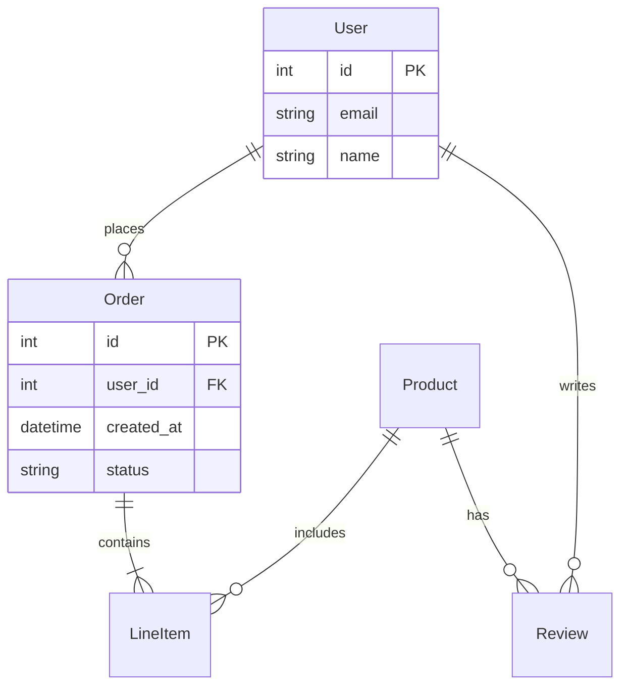
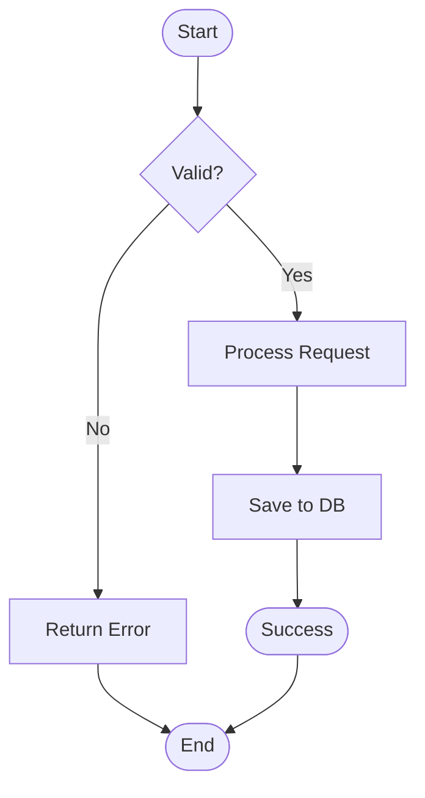
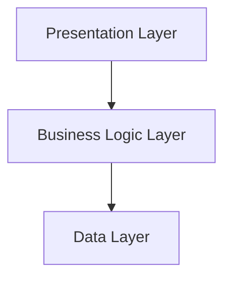
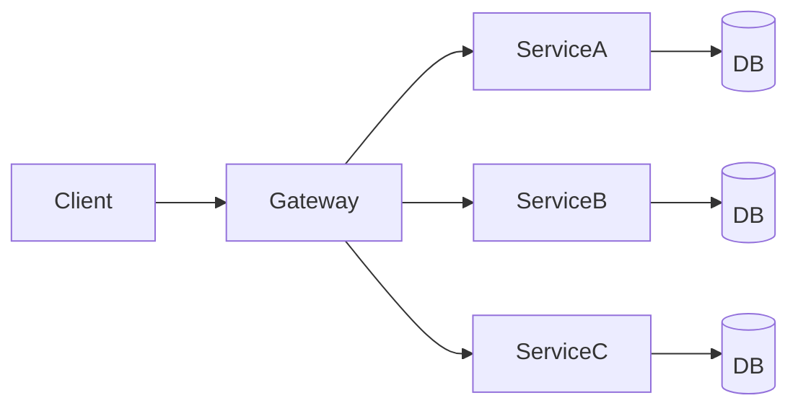
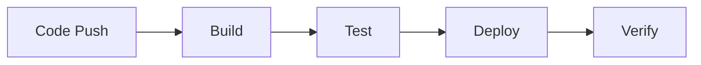

# Mermaid Diagram Standards

Standards for creating Mermaid diagrams in documentation.

## General Principles

1. **Keep it simple**: Don't overcomplicate diagrams
2. **Be consistent**: Use same style across all diagrams
3. **Be readable**: Ensure text is clear and nodes are well-spaced
4. **Be accurate**: Diagrams must reflect actual system
5. **Add context**: Include title or caption

## Diagram Types

### System Architecture (graph TB)

Use for high-level system architecture:

````markdown

````

**Guidelines**:
- Use `TB` (top to bottom) for layered architectures
- Group related components in subgraphs
- Use descriptive node labels
- Show main data flows

### Service Dependencies (graph LR)

Use for service-to-service dependencies:

````markdown

````

**Guidelines**:
- Use `LR` (left to right) for dependencies
- Keep it focused on one aspect
- Don't show every detail

### Sequence Diagrams

Use for request/response flows:

````markdown

````

**Guidelines**:
- Use for time-based interactions
- Show request and response
- Include error paths if important
- Keep participants to 4-6 max

### Entity Relationship Diagrams

Use for database schemas:

````markdown

````

**Guidelines**:
- Show key relationships
- Include primary/foreign keys
- Add important fields only
- Use standard cardinality notation

### Flowcharts

Use for process flows:

````markdown

````

**Guidelines**:
- Use for decision trees
- Show all paths
- Keep it simple
- Use standard shapes

## Node Styles

### Standard Nodes
```mermaid
A[Rectangle] - Default
B(Rounded) - Process
C([Stadium]) - Start/End
D{Diamond} - Decision
E>Flag] - Note
F[(Database)] - Database
```

### Styling
Use subgraphs for grouping:
```mermaid
subgraph "Frontend"
    A[Web]
    B[Mobile]
end
```

Use custom styles sparingly:
```mermaid
style A fill:#f9f,stroke:#333
```

## Arrow Types

- `-->` Solid arrow (default)
- `-.->` Dotted arrow (optional/async)
- `==>` Thick arrow (important)
- `--x` Arrow with X (blocked)

## Best Practices

### Do's
✅ Use clear, descriptive labels
✅ Keep diagrams focused (one concept)
✅ Use subgraphs for logical grouping
✅ Include legend if needed
✅ Test diagram renders correctly

### Don'ts
❌ Don't overcrowd diagrams
❌ Don't use too many colors
❌ Don't mix diagram types
❌ Don't show every detail
❌ Don't use tiny text

## Common Patterns

### Layered Architecture


### Microservices


### CI/CD Pipeline


## Validation

Before committing:
1. Test diagram renders in Docusaurus
2. Check for syntax errors
3. Verify all nodes are labeled
4. Ensure diagram is readable
5. Confirm it matches reality

## Troubleshooting

### Diagram Won't Render
- Check Mermaid syntax
- Verify Mermaid plugin installed
- Look for special characters
- Check for unclosed quotes

### Diagram Too Complex
- Split into multiple diagrams
- Remove unnecessary details
- Focus on one aspect
- Use subgraphs

### Text Overlaps
- Shorten labels
- Adjust layout direction
- Use line breaks in labels
- Simplify structure

