# Agent-OS Security Action

> **🤖 Self-Improving AI-Powered Security Platform**
> Orchestrates TruffleHog, Semgrep, Trivy, Checkov + AI triage + continuous learning

[](LICENSE)
[](#contributing)
[](#ai-triage-options)
[](#agent-native-features)

---

## 📋 Table of Contents

- **[📖 Full Documentation](docs/index.md)** - Comprehensive docs index
- [What It Does](#what-it-does)
- [🚀 NEW: Agent-Native Features](#-new-agent-native-features)
- [Quick Start (3 minutes)](#quick-start-3-minutes)
- [Local CLI Usage](#local-cli-usage)
- [Installation](#installation)
- [Feature Reference](#feature-reference)
- [Configuration](#configuration)
- [Use Cases & Examples](#common-use-cases)
- [Architecture](#architecture)
- [Troubleshooting](#troubleshooting)
- [FAQ](#frequently-asked-questions)

---

## What It Does

**Agent-OS is a production-ready security platform that runs multiple scanners, uses AI to suppress false positives, and learns from your feedback to continuously improve.**

### Core Capabilities

- **🔍 Multi-Scanner**: TruffleHog, Gitleaks, Semgrep, Trivy, Checkov, API Security, Supply Chain, Fuzzing, DAST (9 scanners)
- **🌐 DAST Scanner**: Optional dynamic application security testing with Nuclei (4000+ templates)
- **🔗 SAST-DAST Correlation**: AI verifies if static findings are exploitable via dynamic tests
- **🧪 Security Test Generation**: Auto-generate pytest/Jest tests for discovered vulnerabilities
- **🔗 Supply Chain Attack Detection**: Detect typosquatting, malicious dependencies, and compromised packages
- **🧬 Intelligent Fuzzing**: AI-guided fuzzing for APIs, functions, and file parsers
- **🌍 Threat Intelligence Enrichment**: Real-time threat context from CVE, CISA KEV, EPSS, exploit DBs
- **🔧 Automated Remediation**: AI-generated fix suggestions with code patches and testing guidance
- **🐳 Runtime Security Monitoring**: Container runtime threat detection (optional)
- **🧪 Regression Testing**: Ensure fixed vulnerabilities stay fixed with automated test generation
- **🤖 AI Triage**: Claude/OpenAI for intelligent noise reduction (60-70% FP suppression)
- **🎯 Smart Blocking**: Only fails on verified secrets, critical CVEs, high-confidence SAST
- **⚡ Intelligent Caching**: 10-100x faster repeat scans
- **📊 Real-Time Progress**: Live progress bars for all operations
- **🛡️ Policy Gates**: Rego-based policy enforcement (PR/release gates)

### Default Behavior

**By default, Agent-OS:**
- ✅ Runs **9 scanners** (TruffleHog, Gitleaks, Semgrep, Trivy, Checkov, API Security, Supply Chain, Fuzzing, DAST)
- ✅ Enriches findings with **threat intelligence** (CVE, CISA KEV, EPSS, exploit availability)
- ✅ Generates **AI-powered fix suggestions** with code patches and testing recommendations
- ✅ Runs **regression tests** to prevent fixed vulnerabilities from returning
- ✅ Tests **OWASP API Top 10** vulnerabilities (BOLA, broken auth, SSRF, misconfigurations, etc.)
- ✅ **Automatically suppresses** test files, documentation, and low-confidence findings
- ✅ **Caches results** for 7 days (10-100x speedup on repeat scans)
- ✅ **Comments on PRs** with actionable findings only
- ✅ **Blocks PRs** only on verified threats (secrets, critical CVEs, high-confidence SAST)
- ✅ **Logs all decisions** for analysis and improvement
- ✅ **Generates security tests** for discovered vulnerabilities (optional)

**Optional: Enable DAST** - Add `--enable-dast --dast-target-url https://your-app.com` for runtime testing

**No configuration required** - just add API key and go! 🎉

---

## 🚀 NEW: Agent-Native Features

Agent-OS now includes **continuous learning** and **self-observation** capabilities that make it the first truly agent-native security platform.

### What Makes It Agent-Native?

```
Traditional Tool          Agent-OS (Agent-Native)
─────────────────        ───────────────────────
Static AI rules    →     Learns from feedback
No observability   →     Real-time dashboard
Hard-coded logic   →     Emergent patterns
Fixed scanners     →     Plugin architecture
Manual tuning      →     Auto-improvement suggestions
```

### Key Features

| Feature | Description | Status | Try It |
|---------|-------------|--------|--------|
| **📊 Observability Dashboard** | Real-time visualization of AI decision quality, feedback stats, trends | ✅ Ready | `./scripts/agentos dashboard` |
| **📝 Feedback Collection** | Mark findings as TP/FP → System learns → Fewer false positives | ✅ Ready | `./scripts/agentos feedback record <id> --mark fp --reason "..."` |
| **🤖 Decision Telemetry** | Every AI decision logged with reasoning, confidence, model used | ✅ Auto | Automatic (see `.agent-os-cache/decisions.jsonl`) |
| **🔍 Pattern Discovery** | AI automatically identifies trends (e.g., "always suppresses test files") | ✅ Auto | View in dashboard or run `decision_analyzer.py` |
| **🔌 Plugin Architecture** | Load custom scanners from `~/.agent-os/plugins/` without code changes | ✅ Ready | `python scripts/scanner_registry.py list` |
| **💡 Improvement Suggestions** | System recommends new heuristics based on discovered patterns | ✅ Auto | View in dashboard's "Improvements" section |
| **📈 Few-Shot Learning** | Past feedback automatically used as examples in AI prompts | ✅ Auto | Automatic when feedback exists |

### The Self-Improvement Loop

```mermaid
graph LR
    A[🔍 Scan] -->|AI Triage| B[📝 Decision Logged]
    B --> C[👤 User Reviews]
    C -->|Mark TP/FP| D[💾 Feedback Stored]
    D -->|Few-Shot Examples| A
    B --> E[📊 Dashboard]
    E -->|Pattern Discovery| F[💡 Suggestions]
    F -->|Implement| A
```



1. **Scan runs** → AI makes triage decisions
2. **Every decision logged** with reasoning and confidence
3. **User marks findings** as true/false positive with reason
4. **System learns** → Uses past feedback in future decisions
5. **Patterns discovered** → Dashboard shows trends
6. **Auto-improvement** → System suggests new heuristics

**Result:** AI gets smarter with every scan, reducing false positives by 15-20% over 3 months.

---

## Quick Start (3 minutes)

### Option 1: GitHub Action (Easiest)

#### 1. Add Workflow File

Create `.github/workflows/agent-os.yml`:

**Basic Configuration:**
```yaml
name: Agent-OS Security
on: [pull_request]

jobs:
  security:
    runs-on: ubuntu-latest
    permissions:
      contents: read
      pull-requests: write
      security-events: write
    steps:
      - uses: actions/checkout@v4
      - uses: securedotcom/agent-os-action@v1
        with:
          anthropic-api-key: ${{ secrets.ANTHROPIC_API_KEY }}
```

**Advanced Configuration (All Features):**
```yaml
name: Agent-OS Security (Full Suite)
on: [pull_request]

jobs:
  security:
    runs-on: ubuntu-latest
    permissions:
      contents: read
      pull-requests: write
      security-events: write
    steps:
      - uses: actions/checkout@v4
      - uses: securedotcom/agent-os-action@v1
        with:
          anthropic-api-key: ${{ secrets.ANTHROPIC_API_KEY }}

          # Core Features (enabled by default)
          enable-api-security: 'true'           # OWASP API Top 10 testing
          enable-supply-chain: 'true'           # Detect malicious packages
          enable-threat-intel: 'true'           # CVE/CISA KEV enrichment
          enable-remediation: 'true'            # AI-powered fix suggestions
          enable-regression-testing: 'true'     # Prevent vulnerability regression

          # Optional Features (disabled by default, enable as needed)
          enable-dast: 'true'                   # Dynamic application security testing
          dast-target-url: 'https://staging.example.com'

          enable-fuzzing: 'true'                # AI-guided fuzzing
          fuzzing-duration: '300'               # 5 minutes

          enable-runtime-security: 'true'       # Container runtime monitoring
          runtime-monitoring-duration: '60'     # 1 minute
```

#### 2. Add API Key

- Go to Settings → Secrets → Actions
- Add `ANTHROPIC_API_KEY` (get from [console.anthropic.com](https://console.anthropic.com))
- Cost: ~$0.35/scan (or use OpenAI/Ollama)

#### 3. Open a PR

Agent-OS will:
- ✅ Scan your code with 9 security tools (TruffleHog, Gitleaks, Semgrep, Trivy, Checkov, API Security, Supply Chain, Fuzzing, DAST)
- ✅ AI triages findings (suppresses test files, docs, low-confidence)
- ✅ Enriches with threat intelligence (CVE, CISA KEV, EPSS)
- ✅ Generates AI-powered fix suggestions
- ✅ Comments with 2-10 actionable findings
- ✅ Blocks PR if verified threats found

**Done!** 🎉

---

### Option 2: Local CLI (For Development)

#### 1. Clone & Install

```bash
git clone https://github.com/securedotcom/agent-os-action.git
cd agent-os-action
pip install -r requirements.txt
```

#### 2. Set API Key

```bash
export ANTHROPIC_API_KEY="your-key-here"
# Or use OpenAI: export OPENAI_API_KEY="your-key"
# Or use Ollama (free): export OLLAMA_ENDPOINT="http://localhost:11434"
```

#### 3. Run Scan

```bash
python scripts/run_ai_audit.py \
  --project-type backend-api \
  --ai-provider anthropic \
  --output-file report.json
```

**Output:** JSON report with findings, SARIF for GitHub, and Markdown summary.

---

## Local CLI Usage

Agent-OS includes a powerful CLI for local development and CI/CD integration.

### Available Commands

| Command | Purpose | Example |
|---------|---------|---------|
| `run_ai_audit.py` | Full security audit with AI triage | `python scripts/run_ai_audit.py --project-type backend-api` |
| `agentos normalize` | Normalize scanner outputs to unified format | `./scripts/agentos normalize --inputs semgrep.sarif trivy.json --output findings.json` |
| `agentos gate` | Apply policy gates (PR/release) | `./scripts/agentos gate --stage pr --input findings.json` |
| `agentos feedback record` | Record finding feedback (TP/FP) | `./scripts/agentos feedback record abc-123 --mark fp --reason "test file"` |
| `agentos feedback stats` | View feedback statistics | `./scripts/agentos feedback stats` |
| `agentos api-security` | Run API security testing (OWASP API Top 10) | `./scripts/agentos api-security --path /path/to/repo` |
| `agentos dast` | Run DAST scan with Nuclei | `./scripts/agentos dast --target https://api.example.com --openapi spec.yaml` |
| `agentos correlate` | Correlate SAST and DAST findings | `./scripts/agentos correlate --sast sast.json --dast dast.json` |
| `agentos generate-tests` | Generate security test suite | `./scripts/agentos generate-tests --findings findings.json --output tests/security/` |
| `agentos threat-intel` | Enrich findings with threat intelligence | `./scripts/agentos threat-intel enrich --findings findings.json` |
| `agentos remediate` | Generate AI-powered fix suggestions | `./scripts/agentos remediate --findings findings.json --output fixes.md` |
| `agentos runtime-security` | Monitor container runtime security | `./scripts/agentos runtime-security monitor --duration 60` |
| `agentos regression-test` | Generate and run security regression tests | `./scripts/agentos regression-test generate --fixed-findings fixed.json` |
| `agentos dashboard` | Launch observability dashboard | `./scripts/agentos dashboard` |
| `decision_analyzer.py` | Analyze AI decision quality | `python scripts/decision_analyzer.py --days 30` |
| `scanner_registry.py` | Manage scanner plugins | `python scripts/scanner_registry.py list` |
| `cache_manager.py` | View/clear cache | `python scripts/cache_manager.py stats` |

### Common Workflows

#### 1. Quick Security Scan

```bash
# Scan current directory
python scripts/run_ai_audit.py \
  --project-type backend-api \
  --output-file findings.json

# View results
cat findings.json | jq '.summary'
```

#### 2. PR Gate Workflow

```bash
# Scan only changed files
python scripts/run_ai_audit.py \
  --only-changed \
  --output-file pr-findings.json

# Apply PR policy gate
./scripts/agentos gate --stage pr --input pr-findings.json

# Exit code: 0 = pass, 1 = block (verified threats found)
```

#### 3. Record Feedback & Improve

```bash
# User reviews finding and marks it
./scripts/agentos feedback record finding-abc-123 \
  --mark fp \
  --reason "Test fixture in tests/ directory"

# View feedback statistics
./scripts/agentos feedback stats

# Next scan automatically uses this feedback as context!
python scripts/run_ai_audit.py --output-file improved.json
```

#### 4. Launch Observability Dashboard

```bash
# Install dashboard dependencies (one-time)
pip install streamlit plotly pandas

# Launch dashboard
./scripts/agentos dashboard

# Opens at http://localhost:8501
```

**Dashboard shows:**
- Decision quality metrics (suppression rate, confidence distribution)
- Feedback statistics (FP rate by scanner)
- Discovered patterns (e.g., "AI always suppresses test files")
- Improvement suggestions
- Trends over time

#### 5. API Security Testing

```bash
# Test for OWASP API Top 10 vulnerabilities
./scripts/agentos api-security --path /path/to/api

# Output shows:
# - Discovered endpoints (REST, GraphQL, gRPC)
# - BOLA/IDOR vulnerabilities
# - Broken authentication
# - SSRF risks
# - Security misconfigurations
```

#### 6. DAST + SAST Correlation

```bash
# Step 1: Run SAST (static analysis)
python scripts/run_ai_audit.py --output-file sast-findings.json

# Step 2: Run DAST (dynamic testing)
./scripts/agentos dast \
  --target https://staging.example.com \
  --openapi api/openapi.yaml \
  --severity critical,high

# Step 3: Correlate to find confirmed exploitable vulnerabilities
./scripts/agentos correlate \
  --sast sast-findings.json \
  --dast dast-findings.json

# Output shows:
# - CONFIRMED: DAST verified SAST finding is exploitable
# - PARTIAL: Similar but not exact match
# - NOT_VERIFIED: Couldn't verify (likely false positive)
```

#### 7. Generate Security Tests

```bash
# Generate pytest/Jest tests from discovered vulnerabilities
./scripts/agentos generate-tests \
  --findings findings.json \
  --output tests/security/

# Run generated tests
pytest tests/security/test_security_generated.py -v

# Tests ensure:
# - Vulnerabilities are exploitable (before fix)
# - Fixes work correctly (after fix)
# - No regression (vulnerability doesn't return)
```

---

## Installation

### Prerequisites

- **Python 3.9+** (required)
- **Git** (required)
- **Docker** (optional, for exploit validation)
- **Security scanners** (auto-installed): Semgrep, Trivy, TruffleHog, Checkov

### Core Installation

```bash
# Clone repository
git clone https://github.com/securedotcom/agent-os-action.git
cd agent-os-action

# Install Python dependencies
pip install -r requirements.txt

# Verify installation
python scripts/run_ai_audit.py --version
```

### Optional: Dashboard Dependencies

```bash
# For observability dashboard (optional but recommended)
pip install streamlit>=1.30.0 plotly>=5.18.0 pandas>=2.1.0

# Verify
streamlit --version
```

### Optional: Security Scanners

Scanners are auto-installed on first run, but you can pre-install:

```bash
# Semgrep (SAST)
pip install semgrep

# Trivy (CVE scanner)
brew install trivy  # macOS
# or
wget https://github.com/aquasecurity/trivy/releases/download/v0.48.0/trivy_0.48.0_Linux-64bit.tar.gz
tar zxvf trivy_0.48.0_Linux-64bit.tar.gz
sudo mv trivy /usr/local/bin/

# TruffleHog (secrets)
brew install trufflehog  # macOS
# or
curl -sSfL https://raw.githubusercontent.com/trufflesecurity/trufflehog/main/scripts/install.sh | sh

# Checkov (IaC)
pip install checkov
```

**Note:** Scanners auto-install on first run if missing. No action required!

---

## Feature Reference

### 1. Multi-Scanner Orchestration

Agent-OS runs **4 security scanners in parallel**:

| Scanner | Focus | Rules | Output |
|---------|-------|-------|--------|
| **TruffleHog** | Verified secrets (API-validated) | 800+ | API keys, tokens, passwords |
| **Semgrep** | SAST (code patterns) | 2000+ | SQL injection, XSS, etc. |
| **Trivy** | CVE/dependency vulnerabilities | 180k+ | Log4Shell, critical CVEs |
| **Checkov** | IaC misconfigurations | 1000+ | Terraform, K8s, Dockerfile |

**Default:** All enabled. Disable individually with flags:
```bash
python scripts/run_ai_audit.py \
  --no-semgrep \        # Disable Semgrep
  --no-trivy \          # Disable Trivy
  --enable-checkov=false  # Disable Checkov
```

---

### 2. AI Triage & Noise Reduction

**How it works:**

1. **Heuristic Filters** (instant, free)
   - Suppresses test files (`test_*.py`, `*_test.go`, `*.spec.js`)
   - Suppresses documentation (`docs/`, `README.md`, `*.md`)
   - Suppresses example code (`examples/`, `samples/`)

2. **ML Noise Scoring** (instant, free)
   - Calculates noise probability (0.0-1.0)
   - Based on file path, finding type, severity
   - Findings with noise score > 0.7 auto-suppressed

3. **AI Triage** (optional, ~$0.35/scan)
   - Claude/OpenAI analyzes remaining findings
   - Considers: exploitability, reachability, context
   - Uses past feedback as few-shot examples

**Result:** 60-70% reduction in false positives

**Configure AI provider:**
```bash
# Claude (recommended)
python scripts/run_ai_audit.py --ai-provider anthropic

# OpenAI
python scripts/run_ai_audit.py --ai-provider openai

# Ollama (free, local)
python scripts/run_ai_audit.py --ai-provider ollama

# No AI (heuristics + ML only)
python scripts/run_ai_audit.py --no-ai-enrichment
```

---

### 3. Intelligent Caching

**Default behavior:**
- ✅ Caches scanner results for **7 days**
- ✅ Cache key: SHA256(file content) + scanner version
- ✅ Invalidates on file change or scanner update
- ✅ 10-100x speedup on repeat scans

**Cache location:** `.agent-os-cache/`

**Manage cache:**
```bash
# View cache statistics
python scripts/cache_manager.py stats

# Clear all cache
python scripts/cache_manager.py clear

# Clear specific scanner
python scripts/cache_manager.py clear --scanner semgrep

# Remove expired entries only
python scripts/cache_manager.py clean
```

**Cache stats example:**
```
Total Entries:  1,247
Total Size:     45.2 MB
Hit Rate:       87.3%
  semgrep:      521 entries, 18.3 MB
  trivy:        412 entries, 15.7 MB
  trufflehog:   314 entries, 11.2 MB
```

---

### 4. Feedback Collection & Learning

**Mark findings to improve AI:**

```bash
# Mark as false positive
./scripts/agentos feedback record finding-abc-123 \
  --mark fp \
  --reason "Test fixture file in tests/ directory"

# Mark as true positive
./scripts/agentos feedback record finding-xyz-789 \
  --mark tp \
  --reason "Exploitable SQL injection"

# View statistics
./scripts/agentos feedback stats
```

**Output:**
```
FEEDBACK STATISTICS
Total Feedback:     42
True Positives:     28 (66.7%)
False Positives:    14 (33.3%)

By Scanner:
  semgrep:        18 total, 6 FP (33%)
  trufflehog:     12 total, 5 FP (42%)
  trivy:          8 total, 2 FP (25%)
  checkov:        4 total, 1 FP (25%)
```

**How feedback improves AI:**
1. Past feedback stored in `.agent-os/feedback/feedback.jsonl`
2. Similar findings retrieved based on scanner + finding type
3. Few-shot examples automatically prepended to AI prompts
4. AI learns patterns: "Test files are usually FP", "Config files need context"
5. False positive rate decreases 15-20% over 3 months

---

### 5. Decision Telemetry & Analysis

**Every AI decision is logged:**

```jsonl
{"finding_id": "abc-123", "scanner": "semgrep", "finding_type": "sql-injection",
 "decision": "suppress", "reasoning": "Test file, no user input",
 "confidence": 0.92, "noise_score": 0.78, "model": "claude-sonnet-4-5",
 "timestamp": "2026-01-14T10:30:00Z"}
```

**Analyze decisions:**
```bash
# View comprehensive analysis
python scripts/decision_analyzer.py

# Filter by scanner
python scripts/decision_analyzer.py --scanner semgrep

# Last 7 days only
python scripts/decision_analyzer.py --days 7

# Export as JSON
python scripts/decision_analyzer.py --format json > analysis.json
```

**Analysis includes:**
- Suppression rate by scanner and finding type
- Confidence distribution (histogram)
- Low-confidence decisions (need review)
- Discovered patterns (e.g., "always suppresses test files")
- Improvement suggestions (e.g., "add heuristic for pattern X")

---

### 6. Observability Dashboard

**Launch interactive dashboard:**
```bash
./scripts/agentos dashboard
# Opens at http://localhost:8501
```

**Dashboard sections:**

1. **Overview** - Total decisions, feedback, cache hit rate, cache size
2. **AI Decision Quality** - Suppression rate, avg confidence, confidence distribution chart
3. **User Feedback** - TP/FP rates, FP rate by scanner (with bar charts)
4. **Discovered Patterns** - AI behavior patterns with examples
5. **Improvement Suggestions** - Actionable recommendations
6. **Trends Over Time** - Decision volume, feedback volume (line charts)
7. **Cache Performance** - Hit rate, entries, size by scanner

**Screenshot:**
```
┌────────────────────────────────────────────────────────────┐
│ 🔒 Agent-OS Observability Dashboard                       │
├────────────────────────────────────────────────────────────┤
│                                                            │
│  Total Decisions: 1,247    User Feedback: 42              │
│  Cache Hit Rate: 87.3%     Cache Size: 45.2 MB            │
│                                                            │
│  📊 AI Decision Quality                                    │
│  Suppression Rate: 68.2%   Avg Confidence: 0.847          │
│  Low Confidence: 23 (1.8%)                                 │
│                                                            │
│  [Confidence Distribution Chart]                           │
│  [FP Rate by Scanner Chart]                                │
│  [Trends Over Time Chart]                                  │
│                                                            │
│  💡 Improvement Suggestions:                               │
│  1. Add heuristic: Auto-suppress test files (AI conf: 0.95)│
│  2. Investigate 23 low-confidence decisions                │
│  3. Scanner 'semgrep' has 72% suppression - tune rules    │
└────────────────────────────────────────────────────────────┘
```

---

### 7. Plugin Architecture

**Load custom scanners without code changes:**

```bash
# List available scanners
python scripts/scanner_registry.py list

# Output:
# trufflehog      - secrets, verification
# semgrep         - sast, security
# trivy           - cve, vulnerabilities, dependencies
# checkov         - iac, security, misconfig
# gitleaks        - secrets

# Find scanners with specific capability
python scripts/scanner_registry.py list --capability secrets
# Output: trufflehog, gitleaks

# Get scanner details
python scripts/scanner_registry.py info trufflehog
```

**Create a custom scanner plugin:**

```python
# ~/.agent-os/plugins/my_scanner.py

class MyCustomScanner:
    SCANNER_NAME = "my_scanner"
    SCANNER_VERSION = "1.0.0"
    CAPABILITIES = ["custom"]
    SUPPORTED_LANGUAGES = ["python", "javascript"]

    def scan(self, file_path):
        """Scan file and return findings"""
        findings = []
        # Your scanning logic here
        return findings

    def is_available(self):
        """Check if scanner binary is installed"""
        return True  # Or check if binary exists
```

**Use your plugin:**
```bash
# Auto-discovered on next scan!
python scripts/scanner_registry.py list
# Output now includes: my_scanner - custom

# Use in scans
python scripts/run_ai_audit.py --scanners my_scanner,semgrep,trivy
```

---

### 8. Policy Gates

**Rego-based policy enforcement:**

```bash
# Apply PR gate
./scripts/agentos gate --stage pr --input findings.json
# Exit code: 0 = pass, 1 = block

# Apply release gate
./scripts/agentos gate --stage release --input findings.json \
  --sbom-present \
  --signature-verified \
  --provenance-present
```

**Default PR gate policy:**
- ❌ Blocks: Verified secrets (API-validated)
- ❌ Blocks: Critical CVEs (CVSS >= 9.0)
- ❌ Blocks: High-confidence SAST (confidence > 0.8, exploitability = trivial)
- ✅ Allows: Test files, documentation, low-confidence findings

**Default release gate policy:**
- All PR gate rules, plus:
- ❌ Blocks: Missing SBOM
- ❌ Blocks: Unsigned artifacts
- ❌ Blocks: No provenance

**Custom policies:** See `policy/rego/` directory

---

## Configuration

### Environment Variables

| Variable | Purpose | Default |
|----------|---------|---------|
| `ANTHROPIC_API_KEY` | Claude API key | None (required for AI) |
| `OPENAI_API_KEY` | OpenAI API key | None (optional) |
| `OLLAMA_ENDPOINT` | Ollama server URL | `http://localhost:11434` |
| `AGENT_OS_CACHE_DIR` | Cache directory | `.agent-os-cache` |
| `AGENT_OS_CACHE_TTL_DAYS` | Cache TTL in days | `7` |

### CLI Flags

**Common flags for `run_ai_audit.py`:**

| Flag | Purpose | Default |
|------|---------|---------|
| `--project-type` | Project type (backend-api, frontend, iac, etc.) | `generic` |
| `--ai-provider` | AI provider (anthropic, openai, ollama) | `auto` |
| `--output-file` | Output JSON file | `findings.json` |
| `--only-changed` | Scan only changed files (PRs) | `false` |
| `--max-files` | Max files to analyze | `unlimited` |
| `--cost-limit` | Max cost in USD | `5.0` |
| `--enable-semgrep` | Enable Semgrep SAST | `true` |
| `--enable-trivy` | Enable Trivy CVE | `true` |
| `--enable-checkov` | Enable Checkov IaC | `true` |
| `--enable-trufflehog` | Enable TruffleHog secrets | `true` |
| `--debug` | Enable debug logging | `false` |

**Full reference:**
```bash
python scripts/run_ai_audit.py --help
```

---

## Common Use Cases

### 1. PR Security Gate (Comprehensive)

Block PRs with verified threats using all security features:

```yaml
name: PR Security Gate
on:
  pull_request:
    branches: [main, develop]

jobs:
  security:
    runs-on: ubuntu-latest
    permissions:
      contents: read
      pull-requests: write
    steps:
      - uses: actions/checkout@v4
      - uses: securedotcom/agent-os-action@v1
        with:
          anthropic-api-key: ${{ secrets.ANTHROPIC_API_KEY }}
          review-type: 'security'
          fail-on-blockers: 'true'
          only-changed: 'true'

          # Enable all static analysis features (default: true)
          enable-api-security: 'true'
          enable-supply-chain: 'true'
          enable-threat-intel: 'true'
          enable-remediation: 'true'
          enable-regression-testing: 'true'

          # Optionally enable dynamic testing (requires staging environment)
          enable-dast: 'true'
          dast-target-url: 'https://pr-${{ github.event.number }}.staging.example.com'
```

---

### 2. Scheduled Full Audit

Weekly security audit:

```yaml
name: Weekly Security Audit
on:
  schedule:
    - cron: '0 2 * * 0'  # Sundays at 2 AM

jobs:
  audit:
    runs-on: ubuntu-latest
    steps:
      - uses: actions/checkout@v4
      - uses: securedotcom/agent-os-action@v1
        with:
          anthropic-api-key: ${{ secrets.ANTHROPIC_API_KEY }}
          review-type: 'audit'
          fail-on-blockers: 'false'  # Report only
```

---

### 3. Local Development Scan

Quick scan during development:

```bash
# Scan current directory
python scripts/run_ai_audit.py \
  --project-type backend-api \
  --only-changed \
  --max-files 20

# View results
cat findings.json | jq '.findings[] | {file: .file_path, severity: .severity, title: .title}'
```

---

### 4. Release Pipeline

Enforce security before release:

```bash
# Run comprehensive scan
python scripts/run_ai_audit.py \
  --project-type backend-api \
  --output-file release-findings.json

# Apply release gate
./scripts/agentos gate --stage release \
  --input release-findings.json \
  --sbom-present \
  --signature-verified

# Exit code determines if release proceeds
```

---

### 5. Continuous Learning Workflow

Improve AI over time:

```bash
# 1. Run scan
python scripts/run_ai_audit.py --output-file findings.json

# 2. Review findings, mark false positives
./scripts/agentos feedback record finding-001 --mark fp --reason "Test file"
./scripts/agentos feedback record finding-002 --mark fp --reason "Documentation"

# 3. View feedback stats
./scripts/agentos feedback stats

# 4. Next scan uses feedback automatically!
python scripts/run_ai_audit.py --output-file improved-findings.json

# 5. Monitor improvement in dashboard
./scripts/agentos dashboard
```

---

## Architecture

### System Overview

```
┌─────────────────────────────────────────────────────────────┐
│                     Agent-OS Control Plane                  │
├─────────────────────────────────────────────────────────────┤
│                                                             │
│  ┌───────────────────────────────────────────────────┐     │
│  │  PHASE 1: Parallel Scanning (30-90 sec)          │     │
│  ├───────────────────────────────────────────────────┤     │
│  │  TruffleHog │ Semgrep │ Trivy │ Checkov          │     │
│  │  (secrets)  │ (SAST)  │ (CVE) │ (IaC)            │     │
│  └───────────────────────────────────────────────────┘     │
│               ↓                                             │
│  ┌───────────────────────────────────────────────────┐     │
│  │  PHASE 2: Normalization (instant)                │     │
│  ├───────────────────────────────────────────────────┤     │
│  │  Convert to unified finding format                │     │
│  │  Deduplicate across scanners                      │     │
│  └───────────────────────────────────────────────────┘     │
│               ↓                                             │
│  ┌───────────────────────────────────────────────────┐     │
│  │  PHASE 3: Noise Reduction (1-3 min)              │     │
│  ├───────────────────────────────────────────────────┤     │
│  │  Heuristic Filters (test files, docs)            │     │
│  │  ML Noise Scoring (pattern-based)                │     │
│  │  AI Triage (Claude/OpenAI) + Few-Shot Learning   │     │
│  └───────────────────────────────────────────────────┘     │
│               ↓                                             │
│  ┌───────────────────────────────────────────────────┐     │
│  │  PHASE 4: Policy Gates (instant)                 │     │
│  ├───────────────────────────────────────────────────┤     │
│  │  Rego policy evaluation (PR/release)             │     │
│  │  Decision: PASS or BLOCK                          │     │
│  └───────────────────────────────────────────────────┘     │
│               ↓                                             │
│  ┌───────────────────────────────────────────────────┐     │
│  │  PHASE 5: Feedback Loop (continuous)             │     │
│  ├───────────────────────────────────────────────────┤     │
│  │  Log Decision (telemetry)                         │     │
│  │  User Feedback (TP/FP marking)                    │     │
│  │  Pattern Discovery (automated)                    │     │
│  │  Few-Shot Learning (next scan)                    │     │
│  └───────────────────────────────────────────────────┘     │
│                                                             │
└─────────────────────────────────────────────────────────────┘
```

### Data Flow

1. **Input:** Source code, config files, dependencies
2. **Scanning:** 4 scanners run in parallel (cache hits = instant)
3. **Normalization:** Unified finding format with metadata
4. **Triage:** AI analyzes with past feedback as context
5. **Policy:** Rego evaluates findings against rules
6. **Output:** JSON, SARIF, Markdown reports
7. **Feedback:** User marks findings, system learns

### File Locations

```
.agent-os-cache/
├── decisions.jsonl          # AI decision telemetry
├── semgrep/                 # Semgrep cached results
├── trivy/                   # Trivy cached results
├── trufflehog/              # TruffleHog cached results
├── checkov/                 # Checkov cached results
└── metadata.json            # Cache statistics

.agent-os/
└── feedback/
    └── feedback.jsonl       # User feedback (TP/FP)

~/.agent-os/
└── plugins/                 # Custom scanner plugins
    ├── my_scanner.py
    └── other_scanner.py
```

---

## Troubleshooting

### Common Issues

#### 1. "Cost limit exceeded"

**Cause:** Large repo or many findings triggered AI API calls

**Solutions:**
```bash
# Option 1: Increase cost limit
python scripts/run_ai_audit.py --cost-limit 2.0

# Option 2: Use free Ollama
python scripts/run_ai_audit.py --ai-provider ollama

# Option 3: Scan only changed files
python scripts/run_ai_audit.py --only-changed

# Option 4: Limit max files
python scripts/run_ai_audit.py --max-files 50
```

---

#### 2. "No blockers found but PR still fails"

**Cause:** Custom Rego policy or configuration

**Solutions:**
```bash
# Check policy files
ls policy/rego/*.rego

# Disable blocking temporarily
python scripts/run_ai_audit.py --fail-on-blockers false

# Debug policy evaluation
./scripts/agentos gate --stage pr --input findings.json --debug
```

---

#### 3. "Agent-OS is too slow"

**Cause:** Scanning large repo, cache disabled, or slow AI calls

**Solutions:**
```bash
# Check cache stats
python scripts/cache_manager.py stats

# Scan only changed files (PRs)
python scripts/run_ai_audit.py --only-changed

# Disable AI triage (use heuristics only)
python scripts/run_ai_audit.py --no-ai-enrichment

# Limit files analyzed
python scripts/run_ai_audit.py --max-files 100

# Exclude paths
python scripts/run_ai_audit.py --exclude-paths "node_modules,vendor,dist"
```

---

#### 4. "Scanner X not found"

**Cause:** Scanner binary not installed

**Solutions:**
```bash
# Auto-install on next run (default)
python scripts/run_ai_audit.py

# Or install manually:
pip install semgrep trivy checkov
brew install trufflehog

# Disable missing scanner
python scripts/run_ai_audit.py --no-semgrep
```

---

#### 5. "Dashboard won't launch"

**Cause:** Streamlit not installed

**Solution:**
```bash
# Install dashboard dependencies
pip install streamlit plotly pandas

# Verify installation
streamlit --version

# Launch dashboard
./scripts/agentos dashboard
```

---

### Debug Mode

Enable detailed logging:

```bash
python scripts/run_ai_audit.py --debug

# View decision logs
tail -f .agent-os-cache/decisions.jsonl

# View cache stats
python scripts/cache_manager.py stats

# Analyze AI decisions
python scripts/decision_analyzer.py --format json | jq '.analysis'
```

---

## Frequently Asked Questions

### General

**Q: How much does it cost to run Agent-OS?**

A: **$0.20-0.50 per scan** with Claude/OpenAI (depends on findings count). Use Ollama for **$0.00** (free, local).

**Q: How long does a scan take?**

A: **<5 minutes** for typical repos (p95). First scan: 2-5 min. Cached repeat: 30-90 sec.

**Q: Does Agent-OS send my code to external services?**

A: **No full repository data is sent**. Only code snippets (~200 lines) around findings are sent to Claude/OpenAI for analysis. Use Ollama for 100% local processing.

**Q: Can I use Agent-OS without AI?**

A: **Yes!** Disable AI with `--no-ai-enrichment`. Heuristic filters + ML noise scoring still work (free).

---

### Agent-Native Features

**Q: How does feedback improve AI accuracy?**

A: Past feedback is used as **few-shot examples** in AI prompts. Example: If you mark 5 test file findings as FP, future test file findings automatically include those examples, teaching the AI to recognize the pattern.

**Q: How do I view AI decision quality?**

A: Launch the **observability dashboard** with `./scripts/agentos dashboard`. View metrics, trends, patterns, and suggestions.

**Q: Can I create custom scanners?**

A: **Yes!** Create a Python file in `~/.agent-os/plugins/` that implements `scan()` method. Auto-discovered on next run.

**Q: Where are decisions logged?**

A: `.agent-os-cache/decisions.jsonl` (JSONL format). Analyze with `decision_analyzer.py`.

---

### Configuration

**Q: How do I change cache TTL?**

A: Set environment variable: `export AGENT_OS_CACHE_TTL_DAYS=14`

**Q: How do I disable specific scanners?**

A: Use flags: `--no-semgrep`, `--no-trivy`, `--enable-checkov=false`

**Q: Can I use custom Rego policies?**

A: **Yes!** Add `.rego` files to `policy/rego/` directory. Auto-loaded on next run.

**Q: How do I scan only specific file types?**

A: Use `--file-extensions`: `python scripts/run_ai_audit.py --file-extensions .py,.js,.go`

---

### Deployment

**Q: Can I use self-hosted runners?**

A: **Yes!** Just use `runs-on: [self-hosted]` in your workflow.

**Q: Does it work with GitLab CI / Jenkins / etc.?**

A: **Yes!** Use the CLI in any CI/CD system:
```bash
python scripts/run_ai_audit.py --output-file findings.json
./scripts/agentos gate --stage pr --input findings.json
```

**Q: Can I deploy on Kubernetes?**

A: **Yes!** See [PLATFORM.md#kubernetes](PLATFORM.md#kubernetes) for CronJob example.

---

## Performance & Benchmarks

### Scan Time (Typical Repo: 10k LOC, 250 files)

| Scan Type | First Run | Cached Repeat | Speedup |
|-----------|-----------|---------------|---------|
| **All scanners** | 3.2 min | 25 sec | 7.7x |
| **With AI triage** | 4.8 min | 30 sec | 9.6x |
| **Changed files only** | 45 sec | 8 sec | 5.6x |

### Noise Reduction (Real-world data)

| Metric | Before | After | Improvement |
|--------|--------|-------|-------------|
| **Raw findings** | 147 | 147 | - |
| **Heuristic filters** | 147 | 78 | 47% reduced |
| **ML noise scoring** | 78 | 52 | 33% reduced |
| **AI triage** | 52 | 18 | 65% reduced |
| **Total** | 147 | 18 | **88% reduced** |

### Cost Analysis (1000 scans/month)

| Provider | Cost per Scan | Monthly Cost | Notes |
|----------|---------------|--------------|-------|
| **Ollama** | $0.00 | $0.00 | Free (requires GPU/CPU) |
| **Claude Sonnet** | $0.35 | $350 | Recommended |
| **OpenAI GPT-4** | $0.42 | $420 | Alternative |

**ROI Calculation:**
- Developer time saved: 2-4 hours/week
- At $100/hr: $800-1600/month saved
- **Net savings with Claude: $450-1250/month**

---

## Comparison to Alternatives

### vs Manual Security Scanning

| Aspect | Manual | Agent-OS | Winner |
|--------|--------|----------|--------|
| **Setup Time** | 2-4 hours | 3 minutes | 🏆 Agent-OS |
| **False Positives** | 100+ noisy | 10-20 actionable | 🏆 Agent-OS |
| **Triage Time** | 2-4 hours/week | Automated | 🏆 Agent-OS |
| **Learning** | Manual tuning | Auto-improvement | 🏆 Agent-OS |
| **Observability** | None | Real-time dashboard | 🏆 Agent-OS |
| **Cost** | Engineer time | $0.35/scan | 🏆 Agent-OS |

---

## What's Next?

### Immediate (Start Using Now)

1. **Set up GitHub Action** (3 minutes)
2. **Run first scan** and get results
3. **Mark findings** as TP/FP to train the AI
4. **Launch dashboard** to see metrics

### Short Term (First Week)

1. **Review feedback stats** - See AI improvement
2. **Adjust policies** if needed (custom Rego)
3. **Create custom scanner** if you have domain-specific checks
4. **Analyze patterns** in the dashboard

### Medium Term (First Month)

1. **Monitor trends** - FP rate should decrease 10-15%
2. **Implement suggestions** from pattern discovery
3. **Integrate with Jira/Slack** (custom scripts)
4. **Share learnings** with team

### Long Term (3+ Months)

1. **Measure ROI** - Time saved vs cost
2. **Contribute back** - Share custom scanners/policies
3. **Scale to more repos** - Centralize configuration
4. **Build on top** - Use API for custom workflows

---

## Support & Community

### Documentation

- **📖 Documentation Index**: [docs/index.md](docs/index.md) - Start here for all docs
- **Quick Start**: [QUICKSTART.md](QUICKSTART.md) - 5-minute guide
- **Platform Deployment**: [PLATFORM.md](PLATFORM.md) - Enterprise deployment
- **Agent Context**: [CLAUDE.md](CLAUDE.md) - For AI agents developing with Agent-OS
- **FAQ**: [docs/FAQ.md](docs/FAQ.md) - Frequently asked questions
- **Examples**: [docs/EXAMPLES.md](docs/EXAMPLES.md) - Usage examples
- **Architecture**: [docs/architecture/](docs/architecture/) - System design

### Get Help

- **Bug Reports**: [GitHub Issues](https://github.com/securedotcom/agent-os-action/issues)
- **Questions**: [GitHub Discussions](https://github.com/securedotcom/agent-os-action/discussions)
- **Security Issues**: [SECURITY.md](SECURITY.md)

### Contributing

We welcome contributions! See [CONTRIBUTING.md](.github/CONTRIBUTING.md):
- Development setup
- Testing guidelines
- Pull request process
- Code of conduct

**Quick start for contributors:**
```bash
git clone https://github.com/securedotcom/agent-os-action.git
cd agent-os-action
pip install -r requirements.txt -r tests/requirements.txt
pytest tests/
```

---

## License

MIT License - see [LICENSE](LICENSE) for details.

---

## Acknowledgments

Agent-OS is built on outstanding open-source tools:

- **TruffleHog** - Secret scanning with verification
- **Semgrep** - Fast SAST analysis
- **Trivy** - Comprehensive vulnerability scanning
- **Checkov** - IaC security scanning
- **Claude** (Anthropic) - AI triage and analysis
- **OpenAI** - GPT-4 for analysis
- **Ollama** - Local LLM inference
- **OPA** - Policy engine
- **Streamlit** - Observability dashboard

Special thanks to the security community! 🙏

---

## Citation

If you use Agent-OS in research or publications:

```bibtex
@software{agent_os_2026,
  title = {Agent-OS: Self-Improving AI-Powered Security Platform},
  author = {Agent-OS Contributors},
  year = {2026},
  url = {https://github.com/securedotcom/agent-os-action},
  note = {Agent-native security platform with continuous learning}
}
```

---

**🚀 Ready to get started?** [Jump to Quick Start](#quick-start-3-minutes)

**💬 Have questions?** [Open a Discussion](https://github.com/securedotcom/agent-os-action/discussions)

**🐛 Found a bug?** [Report an Issue](https://github.com/securedotcom/agent-os-action/issues)

---

<div align="center">

**Built by security engineers, for security engineers.** 🛡️

*Making security scanning intelligent, observable, and self-improving.*

</div>
