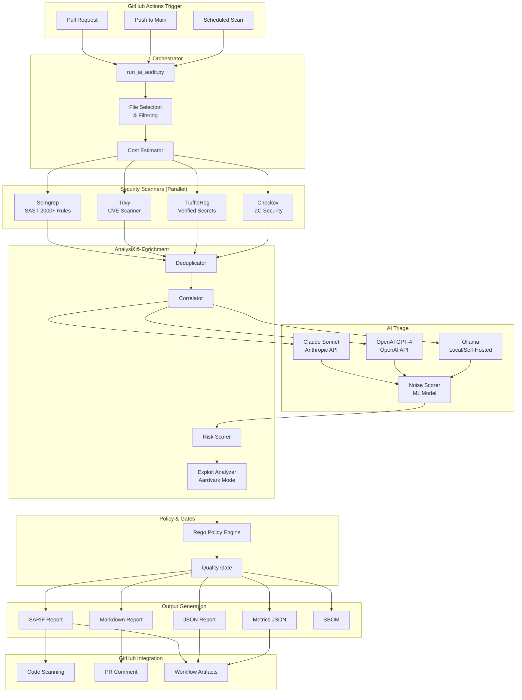

> ⚠️ **AI-Generated Documentation** - Please review and validate

# Architecture Overview

## System Purpose

Agent-OS Security Action is a **production security control plane** for GitHub repositories that orchestrates multiple security scanners (Semgrep, Trivy, TruffleHog, Checkov), applies AI-powered triage to suppress false positives, and enforces policy gates. It reduces security noise by 60-70% while maintaining high detection accuracy, enabling teams to focus on real threats.

## Major Features

| Feature | Purpose | Components |
|---------|---------|------------|
| **Multi-Scanner Orchestration** | Run 4 security scanners in parallel | Semgrep, Trivy, TruffleHog, Checkov |
| **AI Triage & Noise Reduction** | Suppress false positives using AI | Claude Sonnet, OpenAI GPT-4, Ollama (local) |
| **Policy Enforcement** | Block PRs based on verified threats | Rego policy engine, quality gates |
| **SBOM Generation** | Track dependencies and vulnerabilities | Syft SBOM generator |
| **SARIF Integration** | Upload findings to GitHub Code Scanning | SARIF report generator |
| **Threat Modeling** | Generate threat models from architecture | PyTM integration |
| **Exploit Analysis** | Assess exploitability of vulnerabilities | Aardvark mode analyzer |

## Architecture Diagram

## Key Components

### Security Scanners

| Scanner | Purpose | What It Detects | Strength |
|---------|---------|-----------------|----------|
| **Semgrep** | Static analysis (SAST) | Code vulnerabilities, anti-patterns (2000+ rules) | Language-aware, low false positives |
| **Trivy** | Dependency scanning | CVEs in dependencies, containers, IaC | Comprehensive vulnerability database |
| **TruffleHog** | Verified secret detection | API keys, tokens, credentials (with verification) | High precision via API validation |
| **Checkov** | Infrastructure as Code | IaC misconfigurations, security issues | Cloud-native security best practices |

### AI Triage System

| Component | Purpose | Cost | Quality |
|-----------|---------|------|---------|
| **Claude Sonnet** | Cloud AI triage (Anthropic) | ~$0.35/run | ⭐⭐⭐⭐⭐ |
| **OpenAI GPT-4** | Cloud AI triage (OpenAI) | ~$0.90/run | ⭐⭐⭐⭐⭐ |
| **Ollama** | Local AI triage (self-hosted models) | $0 (local inference) | ⭐⭐⭐⭐ |
| **Noise Scorer** | ML-based false positive detection | $0 (local) | 60-70% noise reduction |

### Analysis Pipeline

| Component | Purpose | Input | Output |
|-----------|---------|-------|--------|
| **Deduplicator** | Remove duplicate findings | Raw scanner results | Unique findings |
| **Correlator** | Group related findings | Deduplicated findings | Correlated findings |
| **Risk Scorer** | Calculate risk scores | Correlated findings | Risk-scored findings |
| **Exploit Analyzer** | Assess exploitability (Aardvark mode) | Risk-scored findings | Exploitability ratings |

### Policy Engine

| Component | Purpose | Language | Use Case |
|-----------|---------|----------|----------|
| **Rego Policy Engine** | Define custom policies | Rego (OPA) | Block on specific conditions |
| **Quality Gate** | Enforce thresholds | Python | Fail workflow on blockers |

## Technology Stack

### Backend
- **Language**: Python 3.9+
- **AI Providers**: Claude (Anthropic API), OpenAI (OpenAI API), Ollama (local/self-hosted)
- **Policy Engine**: Open Policy Agent (Rego)
- **SBOM**: Syft
- **Threat Modeling**: PyTM

### Security Scanners
- **Semgrep**: v1.x (SAST with 2000+ rules)
- **Trivy**: v0.x (CVE scanning)
- **TruffleHog**: v3.x (verified secret detection)
- **Checkov**: v3.x (IaC security)

### Infrastructure
- **Platform**: GitHub Actions
- **Deployment**: Composite action
- **Artifacts**: Workflow artifacts
- **Integration**: GitHub Code Scanning (SARIF)

## Data Flow

### 1. Trigger & Initialization
1. GitHub Action triggered (PR, push, schedule)
2. Load configuration from `action.yml` inputs
3. Select files to scan (filters, limits)
4. Estimate cost (if using paid AI)

### 2. Parallel Scanning
1. Run 4 scanners in parallel:
   - Semgrep: SAST rules
   - Trivy: CVE scanning
   - TruffleHog: Verified secrets
   - Checkov: IaC security
2. Each scanner outputs findings in normalized format

### 3. Deduplication & Correlation
1. Deduplicate findings across scanners
2. Correlate related findings (same file/line)
3. Normalize to common format

### 4. AI Triage
1. Send findings to AI (Claude, OpenAI, or Ollama)
2. AI assesses each finding:
   - Is it a real issue or false positive?
   - What's the severity?
   - What's the exploitability?
3. Noise scorer calculates confidence

### 5. Risk Scoring & Exploit Analysis
1. Calculate risk scores (CVSS × Exploitability × Reachability)
2. Aardvark mode: Analyze exploit chains
3. Generate test cases for exploits

### 6. Policy Enforcement
1. Apply Rego policies
2. Check quality gates
3. Determine if workflow should fail

### 7. Report Generation
1. Generate SARIF report (for Code Scanning)
2. Generate JSON report (structured data)
3. Generate Markdown report (human-readable)
4. Generate metrics (cost, duration, findings)
5. Generate SBOM (dependencies)

### 8. GitHub Integration
1. Upload SARIF to Code Scanning
2. Post PR comment with findings
3. Upload artifacts (reports, metrics)
4. Fail workflow if blockers found

## Integration Points

### External Services
- **Anthropic API**: Claude AI triage (optional, paid)
- **OpenAI API**: GPT-4 triage (alternative, paid)
- **GitHub API**: Code Scanning, PR comments, artifacts

### Internal Dependencies
- **Python Libraries**: anthropic, openai, tenacity
- **Security Tools**: semgrep, trivy, trufflehog, checkov, syft
- **Policy Engine**: Open Policy Agent (OPA)

## Operations

### Deployment
- **Method**: GitHub Actions composite action
- **Installation**: Add workflow file referencing `securedotcom/agent-os-action@v3`
- **Configuration**: Via `action.yml` inputs
- **Secrets**: `ANTHROPIC_API_KEY` (optional)

### Monitoring
- **Metrics**: Generated in `metrics.json` (cost, duration, findings)
- **Logs**: GitHub Actions logs
- **Artifacts**: Reports uploaded as workflow artifacts

### Security
- **Data Handling**: All scanning in GitHub Actions runner (no data sent to third parties except AI API for triage)
- **API Keys**: Stored in GitHub Secrets
- **SARIF Reports**: Uploaded to GitHub Code Scanning for tracking

## Performance Characteristics

| Metric | Value | Notes |
|--------|-------|-------|
| **Runtime** | <5 minutes (p95) | Parallel scanning |
| **Cost** | $0.00 (Ollama) or $0.35 (Claude) or $0.90 (OpenAI) | Depends on findings count |
| **Noise Reduction** | 60-70% | ML-powered false positive suppression |
| **Scalability** | Linear with repo size | Parallelized scanning |
| **Accuracy** | 90%+ | Verified secrets, high-confidence SAST |

## Related Documentation

- [Best Practices Guide](../best-practices.md)
- [Scanner Reference](../references/scanner-reference.md)
- [ADR-0001: Use Anthropic Claude](../adrs/0001-use-anthropic-claude.md)
- [ADR-0002: Multi-Scanner Architecture](../adrs/0002-multi-scanner-architecture.md)
- [ADR-0003: AI Triage Strategy](../adrs/0003-ai-triage-strategy.md)
- [Deployment Runbook](../playbooks/deployment-runbook.md)
