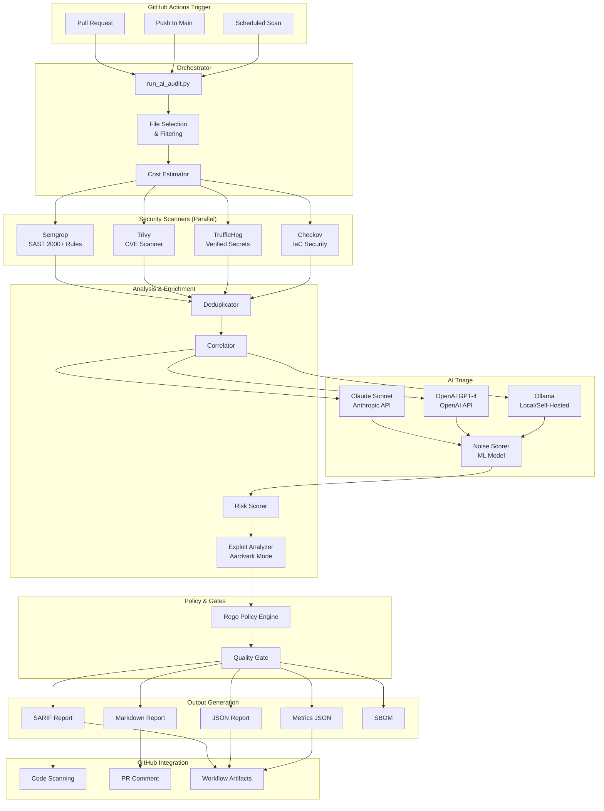

> ⚠️ **AI-Generated Documentation** - Please review and validate

# Architecture Overview

## System Purpose

Agent-OS Security Action is a **production security control plane** for GitHub repositories that orchestrates multiple security scanners (Semgrep, Trivy, TruffleHog, Checkov), applies AI-powered triage to suppress false positives, and enforces policy gates. It reduces security noise by 60-70% while maintaining high detection accuracy, enabling teams to focus on real threats.

## Major Features

| Feature | Purpose | Components |
|---------|---------|------------|
| **Multi-Scanner Orchestration** | Run 5 security scanners in parallel | Semgrep, Trivy, TruffleHog, Gitleaks, Checkov |
| **AI Triage & Noise Reduction** | Suppress false positives using AI | Claude Sonnet, OpenAI GPT-4, Ollama (local) |
| **Automated Remediation** | AI-generated fix suggestions | remediation_engine.py |
| **Spontaneous Discovery** | Find issues beyond scanner rules | spontaneous_discovery.py |
| **Multi-Agent Personas** | Specialized AI experts for different domains | agent_personas.py |
| **Sandbox Validation** | Docker-based exploit verification | sandbox_validator.py |
| **Policy Enforcement** | Block PRs based on verified threats | Rego policy engine, quality gates |
| **SARIF Integration** | Upload findings to GitHub Code Scanning | SARIF report generator |
| **Threat Modeling** | Generate threat models from architecture | PyTM integration |

## Security Pipeline (6 Phases)

```
┌─────────────────────────────────────────────────────────────────┐
│ PHASE 1: Fast Deterministic Scanning (30-60 sec)                │
│   ├─ Semgrep (SAST - 2,000+ rules)                              │
│   ├─ Trivy (CVE/Dependencies)                                   │
│   ├─ Checkov (IaC security)                                     │
│   ├─ TruffleHog (Verified secrets)                              │
│   └─ Gitleaks (Pattern-based secrets)                           │
├─────────────────────────────────────────────────────────────────┤
│ PHASE 2: AI Enrichment (2-5 min)                                │
│   ├─ Claude/OpenAI/Ollama analysis                              │
│   ├─ Noise scoring & false positive prediction                  │
│   ├─ CWE mapping & risk scoring                                 │
│   └─ Threat Model Generation (pytm + AI)                        │
├─────────────────────────────────────────────────────────────────┤
│ PHASE 2.5: Automated Remediation                                │
│   └─ AI-Generated Fix Suggestions (remediation_engine.py)       │
│       - SQL Injection → Parameterized queries                   │
│       - XSS → Output escaping, CSP                              │
│       - Command Injection → Input sanitization                  │
│       - Path Traversal, SSRF, XXE, CSRF, etc.                   │
├─────────────────────────────────────────────────────────────────┤
│ PHASE 2.6: Spontaneous Discovery                                │
│   └─ Find issues BEYOND scanner rules (spontaneous_discovery.py)│
│       - Architecture risk analysis (missing auth, weak crypto)  │
│       - Hidden vulnerability detection (race conditions, logic) │
│       - Configuration security checks                           │
│       - Data security analysis (PII exposure)                   │
├─────────────────────────────────────────────────────────────────┤
│ PHASE 3: Multi-Agent Persona Review (agent_personas.py)         │
│   ├─ SecretHunter      - API keys, credentials expert           │
│   ├─ ArchitectureReviewer - Design flaws, security gaps         │
│   ├─ ExploitAssessor   - Real-world exploitability analysis     │
│   ├─ FalsePositiveFilter - Noise suppression, test code ID      │
│   └─ ThreatModeler     - Attack chains, threat scenarios        │
├─────────────────────────────────────────────────────────────────┤
│ PHASE 4: Sandbox Validation (sandbox_validator.py)              │
│   └─ Docker-based Exploit Validation                            │
│       - Isolated container execution                            │
│       - Multi-language support (Python, JS, Java, Go)           │
│       - 14 exploit types supported                              │
├─────────────────────────────────────────────────────────────────┤
│ PHASE 5: Policy Gates (gate.py)                                 │
│   └─ Rego/OPA policy evaluation → PASS/FAIL                     │
├─────────────────────────────────────────────────────────────────┤
│ PHASE 6: Reporting                                              │
│   ├─ SARIF (GitHub code scanning)                               │
│   ├─ JSON (programmatic access)                                 │
│   └─ Markdown (PR comments)                                     │
└─────────────────────────────────────────────────────────────────┘
```

**Default Phase Configuration (hybrid_analyzer.py):**
| Phase | Flag | Default |
|-------|------|---------|
| 1 | `enable_semgrep`, `enable_trivy`, `enable_checkov` | ✅ True |
| 2 | `enable_ai_enrichment` | ✅ True |
| 2.5 | `enable_remediation` | ✅ True |
| 2.6 | `enable_spontaneous_discovery` | ✅ True |
| 3 | `enable_multi_agent` | ✅ True |
| 4 | `enable_sandbox` | ✅ True |
| 5-6 | Policy gates & Reporting | ✅ Always |

## Architecture Diagram



## Key Components

### Phase 1: Security Scanners

| Scanner | Purpose | What It Detects | Strength |
|---------|---------|-----------------|----------|
| **Semgrep** | Static analysis (SAST) | Code vulnerabilities, anti-patterns (2000+ rules) | Language-aware, low false positives |
| **Trivy** | Dependency scanning | CVEs in dependencies, containers, IaC | Comprehensive vulnerability database |
| **TruffleHog** | Verified secret detection | API keys, tokens, credentials (with verification) | High precision via API validation |
| **Gitleaks** | Pattern-based secrets | Secrets in code and git history | Fast pattern matching |
| **Checkov** | Infrastructure as Code | IaC misconfigurations, security issues | Cloud-native security best practices |

### AI Triage System

| Component | Purpose | Cost | Quality |
|-----------|---------|------|---------|
| **Claude Sonnet** | Cloud AI triage (Anthropic) | ~$0.35/run | ⭐⭐⭐⭐⭐ |
| **OpenAI GPT-4** | Cloud AI triage (OpenAI) | ~$0.90/run | ⭐⭐⭐⭐⭐ |
| **Ollama** | Local AI triage (self-hosted models) | $0 (local inference) | ⭐⭐⭐⭐ |
| **Noise Scorer** | ML-based false positive detection | $0 (local) | 60-70% noise reduction |

### Phases 2.5-4: AI-Powered Modules

| Module | Phase | Purpose | Key Features |
|--------|-------|---------|--------------|
| **remediation_engine.py** | 2.5 | AI-generated fix suggestions | Unified diffs, testing recommendations |
| **spontaneous_discovery.py** | 2.6 | Find issues beyond scanner rules | Architecture risks, hidden vulns, >0.7 confidence |
| **agent_personas.py** | 3 | Multi-agent persona review | 5 specialized experts (SecretHunter, etc.) |
| **sandbox_validator.py** | 4 | Docker-based exploit validation | 14 exploit types, isolated execution |

### Analysis Pipeline

| Component | Purpose | Input | Output |
|-----------|---------|-------|--------|
| **Deduplicator** | Remove duplicate findings | Raw scanner results | Unique findings |
| **Correlator** | Group related findings | Deduplicated findings | Correlated findings |
| **Risk Scorer** | Calculate risk scores | Correlated findings | Risk-scored findings |
| **Exploit Analyzer** | Assess exploitability | Risk-scored findings | Exploitability ratings |

### Policy Engine

| Component | Purpose | Language | Use Case |
|-----------|---------|----------|----------|
| **Rego Policy Engine** | Define custom policies | Rego (OPA) | Block on specific conditions |
| **Quality Gate** | Enforce thresholds | Python | Fail workflow on blockers |

## Technology Stack

### Backend
- **Language**: Python 3.9+
- **AI Providers**: Claude (Anthropic API), OpenAI (OpenAI API), Ollama (local/self-hosted)
- **Policy Engine**: Open Policy Agent (Rego)
- **SBOM**: Syft
- **Threat Modeling**: PyTM

### Security Scanners
- **Semgrep**: v1.x (SAST with 2000+ rules)
- **Trivy**: v0.x (CVE scanning)
- **TruffleHog**: v3.x (verified secret detection)
- **Checkov**: v3.x (IaC security)

### Infrastructure
- **Platform**: GitHub Actions
- **Deployment**: Composite action
- **Artifacts**: Workflow artifacts
- **Integration**: GitHub Code Scanning (SARIF)

## Data Flow (6 Phases)

### Phase 1: Fast Deterministic Scanning (30-60 sec)
1. GitHub Action triggered (PR, push, schedule)
2. Load configuration from `action.yml` inputs
3. Run 5 scanners in parallel:
   - Semgrep: SAST rules (2,000+)
   - Trivy: CVE/dependency scanning
   - Checkov: IaC security
   - TruffleHog: Verified secrets
   - Gitleaks: Pattern-based secrets
4. Each scanner outputs findings in normalized format

### Phase 2: AI Enrichment (2-5 min)
1. Deduplicate findings across scanners
2. Send findings to AI (Claude, OpenAI, or Ollama)
3. AI assesses each finding:
   - Is it a real issue or false positive?
   - What's the severity and exploitability?
   - CWE mapping and risk scoring
4. Threat model generation (pytm + AI)

### Phase 2.5: Automated Remediation
1. `remediation_engine.py` generates fix suggestions
2. AI-powered code patches for common vulnerabilities
3. Unified diff generation for easy patching
4. Testing recommendations for each fix

### Phase 2.6: Spontaneous Discovery
1. `spontaneous_discovery.py` analyzes codebase
2. Finds issues BEYOND scanner rules:
   - Architecture risks (missing auth, weak crypto)
   - Hidden vulnerabilities (race conditions, logic flaws)
   - Configuration security issues
   - Data security problems (PII exposure)
3. Only returns findings with >0.7 confidence

### Phase 3: Multi-Agent Persona Review
1. `agent_personas.py` routes findings to specialized agents:
   - SecretHunter: API keys, credentials
   - ArchitectureReviewer: Design flaws
   - ExploitAssessor: Exploitability analysis
   - FalsePositiveFilter: Noise suppression
   - ThreatModeler: Attack chains
2. Each agent provides domain-expert analysis

### Phase 4: Sandbox Validation
1. `sandbox_validator.py` validates exploits in Docker
2. Isolated container execution for safety
3. Tests 14 exploit types (SQL injection, XSS, SSRF, etc.)
4. Categorizes results: EXPLOITABLE, NOT_EXPLOITABLE, PARTIAL

### Phase 5: Policy Gates
1. `gate.py` applies Rego/OPA policies
2. Check quality gates (PR gate, release gate)
3. Determine if workflow should PASS or BLOCK

### Phase 6: Reporting
1. Generate SARIF report (for GitHub Code Scanning)
2. Generate JSON report (structured data)
3. Generate Markdown report (PR comments)
4. Upload artifacts to GitHub
5. Fail workflow if blockers found

## Integration Points

### External Services
- **Anthropic API**: Claude AI triage (optional, paid)
- **OpenAI API**: GPT-4 triage (alternative, paid)
- **GitHub API**: Code Scanning, PR comments, artifacts

### Internal Dependencies
- **Python Libraries**: anthropic, openai, tenacity
- **Security Tools**: semgrep, trivy, trufflehog, checkov, syft
- **Policy Engine**: Open Policy Agent (OPA)

## Operations

### Deployment
- **Method**: GitHub Actions composite action
- **Installation**: Add workflow file referencing `securedotcom/agent-os-action@v3`
- **Configuration**: Via `action.yml` inputs
- **Secrets**: `ANTHROPIC_API_KEY` (optional)

### Monitoring
- **Metrics**: Generated in `metrics.json` (cost, duration, findings)
- **Logs**: GitHub Actions logs
- **Artifacts**: Reports uploaded as workflow artifacts

### Security
- **Data Handling**: All scanning in GitHub Actions runner (no data sent to third parties except AI API for triage)
- **API Keys**: Stored in GitHub Secrets
- **SARIF Reports**: Uploaded to GitHub Code Scanning for tracking

## Performance Characteristics

| Metric | Value | Notes |
|--------|-------|-------|
| **Runtime** | <5 minutes (p95) | Parallel scanning |
| **Cost** | $0.00 (Ollama) or $0.35 (Claude) or $0.90 (OpenAI) | Depends on findings count |
| **Noise Reduction** | 60-70% | ML-powered false positive suppression |
| **Scalability** | Linear with repo size | Parallelized scanning |
| **Accuracy** | 90%+ | Verified secrets, high-confidence SAST |

## Related Documentation

- [Best Practices Guide](../best-practices.md)
- [Scanner Reference](../references/scanner-reference.md)
- [ADR-0001: Use Anthropic Claude](../adrs/0001-use-anthropic-claude.md)
- [ADR-0002: Multi-Scanner Architecture](../adrs/0002-multi-scanner-architecture.md)
- [ADR-0003: AI Triage Strategy](../adrs/0003-ai-triage-strategy.md)
- [Deployment Runbook](../playbooks/deployment-runbook.md)
