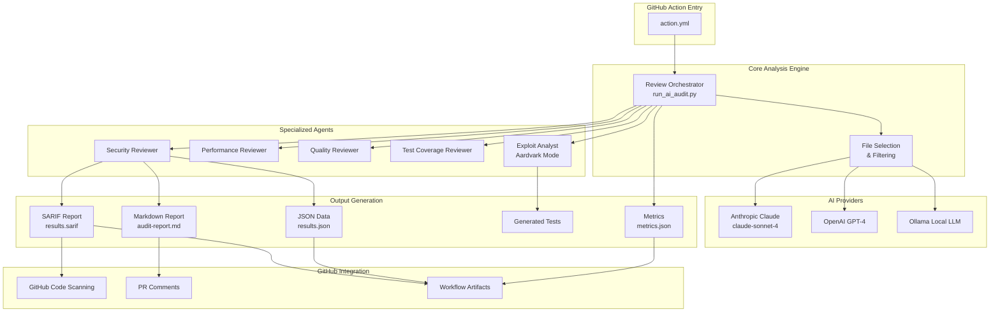

> ⚠️ **AI-Generated Documentation**
> This page was generated by analyzing the codebase.
> Please review and validate for accuracy.

# Architecture Overview

## Purpose

Agent OS Code Reviewer is an AI-powered code review system that provides comprehensive security analysis, exploit detection, and automated test generation for GitHub repositories. It operates as a GitHub Action, integrating seamlessly into CI/CD pipelines.

## System Context

The system analyzes code quality, security vulnerabilities, performance issues, and test coverage using multiple AI providers (Anthropic Claude, OpenAI, Ollama). It generates actionable reports in multiple formats (SARIF, JSON, Markdown) and integrates with GitHub's security features.

## Key Components

- **Review Orchestrator**: Coordinates multi-agent analysis workflow and manages execution modes
- **Security Reviewer**: Identifies security vulnerabilities with exploitability scoring
- **Performance Reviewer**: Analyzes performance bottlenecks and optimization opportunities
- **Quality Reviewer**: Evaluates code quality and best practices
- **Test Coverage Reviewer**: Identifies testing gaps and generates test suggestions
- **Exploit Analyst (Aardvark Mode)**: Analyzes exploit chains and attack vectors
- **Test Generator**: Auto-generates security test cases for vulnerabilities
- **Report Generator**: Creates SARIF, JSON, and Markdown reports

## Architecture Diagram



## Technology Stack

### Backend
- **Language**: Python 3.9+
- **AI Providers**: 
  - Anthropic Claude (primary)
  - OpenAI GPT-4 (alternative)
  - Ollama (local/self-hosted)
- **Key Libraries**:
  - `anthropic>=0.18.0`: Claude AI integration
  - `openai>=1.0.0`: GPT-4 integration
  - `tenacity>=8.0.0`: Retry logic and resilience

### Testing
- **Framework**: pytest
- **Coverage**: pytest-cov
- **Mocking**: pytest-mock
- **Quality**: black, pylint, mypy

### Infrastructure
- **Platform**: GitHub Actions
- **Deployment**: Composite action
- **CI/CD**: GitHub Actions workflows
- **Artifacts**: Workflow artifacts for reports

## Data Flow

### Single-Agent Mode (Recommended)

1. **Trigger**: GitHub Action triggered on push/PR/workflow_dispatch
2. **Initialization**: Load configuration and API keys from secrets
3. **File Selection**: Identify files to analyze based on filters
4. **Cost Estimation**: Calculate estimated cost before analysis
5. **AI Analysis**: Single agent analyzes all aspects (security, performance, quality, testing)
6. **Exploit Detection**: Aardvark mode analyzes exploitability if enabled
7. **Report Generation**: Create SARIF, JSON, and Markdown outputs
8. **GitHub Integration**: Upload SARIF, post PR comment, save artifacts
9. **Quality Gate**: Fail workflow if blockers found (configurable)

**Cost**: ~$0.30 per run | **Time**: 2-3 minutes

### Multi-Agent Mode (Sequential)

1-4. Same as single-agent mode
5. **Specialized Analysis**: Each agent analyzes specific aspect sequentially
   - Security Reviewer → Security vulnerabilities
   - Performance Reviewer → Performance issues
   - Quality Reviewer → Code quality
   - Test Coverage Reviewer → Testing gaps
6-9. Same as single-agent mode

**Cost**: ~$2-3 per run (7x more) | **Time**: 10-15 minutes

⚠️ **Not recommended**: Similar quality to single-agent but 7x more expensive

## External Dependencies

### Required
- **Anthropic API**: Claude AI access (or OpenAI/Ollama alternative)
- **GitHub Actions**: Execution environment
- **Git**: Repository access

### Optional
- **GitHub Code Scanning**: SARIF upload integration
- **GitHub Advanced Security**: Enhanced security features

## Security Considerations

- **API Keys**: Stored in GitHub Secrets, never exposed in logs
- **SARIF Reports**: Uploaded to GitHub Code Scanning for security tracking
- **Exploit Analysis**: Identifies exploitability without executing exploits
- **Cost Guardrails**: Configurable cost limits to prevent overruns
- **Sandboxed Execution**: Runs in isolated GitHub Actions environment

## Scalability

### Performance Characteristics

| Metric | Single-Agent | Multi-Agent |
|--------|--------------|-------------|
| Cost per run | ~$0.30 | ~$2-3 |
| Time per run | 2-3 min | 10-15 min |
| Files analyzed | Up to 50 (configurable) | Up to 50 |
| Quality | Excellent | Similar |

### Optimization Strategies

1. **Path Filtering**: Use `include-paths` and `exclude-paths`
2. **File Limits**: Configure `max-files` (default: 50)
3. **Cost Caps**: Set `cost-limit` to prevent overruns
4. **PR Mode**: Use `only-changed: true` for PRs
5. **Single-Agent**: Use `multi-agent-mode: single` (recommended)

## Monitoring & Observability

### Metrics Tracked

All runs generate `metrics.json` with:
- Files reviewed and lines analyzed
- Tokens consumed (input/output)
- Cost in USD
- Duration in seconds
- Findings by severity (critical/high/medium/low)
- Findings by category (security/performance/testing/quality)
- Exploitability scores (trivial/moderate/complex/theoretical)
- Exploit chains found
- Tests generated

### Example Metrics

```json
{
  "version": "1.0.16",
  "timestamp": "2024-11-07T10:30:00Z",
  "files_reviewed": 25,
  "lines_analyzed": 3500,
  "tokens_input": 45000,
  "tokens_output": 5000,
  "cost_usd": 0.285,
  "duration_seconds": 145,
  "findings": {
    "critical": 2,
    "high": 5,
    "medium": 12,
    "low": 8
  },
  "exploitability": {
    "trivial": 1,
    "moderate": 3,
    "complex": 1
  }
}
```

## Integration Points

### GitHub Actions
- Triggered by push, PR, or manual dispatch
- Requires permissions: contents:write, pull-requests:write, security-events:write
- Uploads artifacts for report download

### GitHub Code Scanning
- SARIF format reports uploaded automatically
- Integrates with Security tab
- Provides vulnerability tracking

### Pull Requests
- Posts review comments with findings
- Includes severity and category
- Links to detailed reports

## Related Documentation

- [Security Reviewer Component](./security-reviewer.md)
- [Exploit Analyst (Aardvark Mode)](./exploit-analyst.md)
- [Report Generator](./report-generator.md)
- [ADR-0001: Use Anthropic Claude](../adrs/0001-use-anthropic-claude.md)
- [ADR-0002: Multi-Agent Architecture](../adrs/0002-multi-agent-architecture.md)

