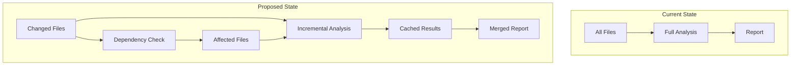

> ⚠️ **AI-Generated RFC Draft**
> This RFC was automatically generated based on codebase analysis.
> It requires human review, validation, and discussion before implementation.

# RFC-0001: Incremental Analysis for Cost Optimization

## Status

**Draft** - Requires team review and approval

## Context

Currently, the Agent OS Code Reviewer analyzes all selected files on every run, regardless of whether they've changed. This leads to:

- **Redundant Analysis**: Unchanged files are re-analyzed unnecessarily
- **Higher Costs**: Full analysis costs ~$0.30-3.00 per run
- **Slower Feedback**: Analysis takes 2-15 minutes even for small changes
- **Wasted Resources**: API quota consumed on duplicate work

### Current Behavior

```yaml
# PR with 3 changed files out of 50 total
- Analyzes: All 50 files
- Cost: ~$0.30 (single-agent)
- Time: 2-3 minutes
```

### Evidence from Codebase

- File selection in `run_ai_audit.py` doesn't track previous analysis
- No caching mechanism for analysis results
- `only-changed` flag exists but still re-analyzes changed files completely
- No incremental update strategy

## Problem Statement

How can we reduce cost and time by only analyzing what has actually changed, while maintaining analysis quality and detecting cross-file impacts?

## Proposal

### Overview

Implement an incremental analysis system that:
1. Tracks file hashes and previous analysis results
2. Only analyzes changed files
3. Detects cross-file dependencies
4. Re-analyzes dependent files when dependencies change
5. Caches and reuses previous findings for unchanged files

### Architecture



### Implementation Details

#### 1. Analysis Cache

Store analysis results with file metadata:

```json
{
  "version": "1.0.0",
  "timestamp": "2024-11-07T10:30:00Z",
  "files": {
    "src/api/users.py": {
      "hash": "abc123...",
      "last_analyzed": "2024-11-07T10:30:00Z",
      "findings": [
        {
          "severity": "high",
          "category": "security",
          "line": 45,
          "message": "SQL injection vulnerability",
          "hash": "finding-xyz789"
        }
      ]
    }
  }
}
```

**Storage Location**: `.agent-os/cache/analysis-cache.json`

#### 2. Change Detection

```python
def get_changed_files(base_ref: str, head_ref: str) -> List[str]:
    """Get files changed between two git refs."""
    result = subprocess.run(
        ['git', 'diff', '--name-only', base_ref, head_ref],
        capture_output=True,
        text=True
    )
    return result.stdout.strip().split('\n')

def get_file_hash(filepath: str) -> str:
    """Get SHA256 hash of file contents."""
    with open(filepath, 'rb') as f:
        return hashlib.sha256(f.read()).hexdigest()
```

#### 3. Dependency Graph

Build dependency graph to detect affected files:

```python
def build_dependency_graph(files: List[str]) -> Dict[str, Set[str]]:
    """Build graph of file dependencies (imports, includes, etc.)."""
    graph = {}
    for file in files:
        deps = extract_dependencies(file)  # Parse imports
        graph[file] = set(deps)
    return graph

def get_affected_files(changed: Set[str], graph: Dict[str, Set[str]]) -> Set[str]:
    """Get all files affected by changes (transitive closure)."""
    affected = set(changed)
    queue = list(changed)
    
    while queue:
        file = queue.pop(0)
        # Find files that depend on this file
        for dependent, deps in graph.items():
            if file in deps and dependent not in affected:
                affected.add(dependent)
                queue.append(dependent)
    
    return affected
```

#### 4. Incremental Analysis Workflow

```python
def incremental_analysis(
    all_files: List[str],
    base_ref: str = 'main',
    cache_file: str = '.agent-os/cache/analysis-cache.json'
) -> AnalysisResult:
    # 1. Load previous analysis cache
    cache = load_cache(cache_file)
    
    # 2. Detect changed files
    changed_files = get_changed_files(base_ref, 'HEAD')
    
    # 3. Build dependency graph
    dep_graph = build_dependency_graph(all_files)
    
    # 4. Find affected files (changed + dependents)
    affected_files = get_affected_files(set(changed_files), dep_graph)
    
    # 5. Filter out unchanged files with valid cache
    files_to_analyze = []
    for file in affected_files:
        current_hash = get_file_hash(file)
        cached = cache.get(file)
        
        if not cached or cached['hash'] != current_hash:
            files_to_analyze.append(file)
    
    # 6. Analyze only necessary files
    new_findings = analyze_files(files_to_analyze)
    
    # 7. Merge with cached findings
    all_findings = merge_findings(cache, new_findings, all_files)
    
    # 8. Update cache
    update_cache(cache_file, all_findings)
    
    return all_findings
```

### Configuration

Add new action inputs:

```yaml
inputs:
  incremental:
    description: 'Enable incremental analysis (only analyze changed files)'
    required: false
    default: 'true'
  
  base-ref:
    description: 'Base git ref for comparison (default: main)'
    required: false
    default: 'main'
  
  cache-ttl:
    description: 'Cache time-to-live in days (default: 7)'
    required: false
    default: '7'
  
  force-full-analysis:
    description: 'Force full analysis ignoring cache'
    required: false
    default: 'false'
```

### Usage Examples

#### PR Review (Incremental)
```yaml
- uses: securedotcom/agent-os-action@v4
  with:
    anthropic-api-key: ${{ secrets.ANTHROPIC_API_KEY }}
    incremental: true
    base-ref: ${{ github.base_ref }}
```

**Expected**: Only analyze changed files + dependents  
**Cost**: ~$0.05-0.15 (5x reduction)  
**Time**: 30-60 seconds (3x faster)

#### Weekly Audit (Full)
```yaml
- uses: securedotcom/agent-os-action@v4
  with:
    anthropic-api-key: ${{ secrets.ANTHROPIC_API_KEY }}
    incremental: false
    force-full-analysis: true
```

**Expected**: Full analysis with cache refresh  
**Cost**: ~$0.30 (same as current)  
**Time**: 2-3 minutes (same as current)

## Impact

### Positive

- **Cost Reduction**: 70-90% cost reduction for typical PRs
  - Current: $0.30 per PR
  - Proposed: $0.05-0.15 per PR
  - Annual savings (100 PRs/month): ~$300-400/year
- **Faster Feedback**: 3x faster analysis (30-60s vs 2-3min)
- **Better UX**: Developers get feedback sooner
- **Scalability**: Can handle larger repos without proportional cost increase
- **Smarter Analysis**: Focus on what actually changed

### Negative

- **Complexity**: More complex implementation and testing
- **Cache Management**: Need to handle cache invalidation, corruption, size limits
- **False Negatives**: Risk of missing cross-file issues if dependency detection is incomplete
- **Storage**: Requires persistent cache storage (GitHub Actions cache or artifacts)
- **Migration**: Existing users need to understand new behavior

### Neutral

- **Opt-in by Default**: Can be disabled with `incremental: false`
- **Fallback**: Falls back to full analysis if cache is invalid or missing
- **Compatibility**: Backward compatible with existing workflows

## Risks & Mitigations

### Risk 1: Missed Cross-File Issues
**Risk**: Dependency detection might miss indirect dependencies

**Mitigation**:
- Conservative dependency detection (over-include rather than under-include)
- Periodic full analysis (weekly/monthly)
- Manual override: `force-full-analysis: true`
- Logging: Track cache hit rate and dependency detection accuracy

### Risk 2: Cache Corruption
**Risk**: Corrupted cache leads to incorrect results

**Mitigation**:
- Cache versioning and validation
- Checksum verification
- Automatic cache invalidation on corruption
- Fallback to full analysis

### Risk 3: Storage Limits
**Risk**: Cache grows too large for GitHub Actions cache (10GB limit)

**Mitigation**:
- Cache TTL (default: 7 days)
- LRU eviction for old entries
- Compression
- Separate cache per branch

### Risk 4: Complexity
**Risk**: Implementation complexity leads to bugs

**Mitigation**:
- Phased rollout (opt-in beta → default)
- Comprehensive testing
- Clear documentation
- Monitoring and metrics

## Alternatives Considered

### Alternative 1: Only Use Git Diff (No Dependency Detection)
**Pros**:
- Simpler implementation
- No dependency graph needed

**Cons**:
- Misses cross-file impacts
- Could miss security issues in dependent files

**Why not chosen**: Too risky for security analysis

### Alternative 2: Client-Side Caching (User's Machine)
**Pros**:
- Faster cache access
- No GitHub Actions cache limits

**Cons**:
- Doesn't work for GitHub Actions
- Not applicable to CI/CD use case

**Why not chosen**: Primary use case is GitHub Actions

### Alternative 3: Server-Side Analysis Service
**Pros**:
- Centralized caching
- Better deduplication across repos

**Cons**:
- Requires infrastructure
- Privacy concerns (code leaves GitHub)
- Additional cost

**Why not chosen**: Adds complexity and cost

## Open Questions

1. **Cache Storage**: Use GitHub Actions cache or artifacts?
   - Actions cache: Faster, 10GB limit, 7-day TTL
   - Artifacts: Slower, no size limit, 90-day retention

2. **Dependency Detection**: How deep should we go?
   - Direct imports only?
   - Transitive dependencies?
   - Dynamic imports?

3. **Cache Invalidation**: When should we invalidate?
   - On major version updates?
   - On model changes?
   - On configuration changes?

4. **Metrics**: What should we track?
   - Cache hit rate
   - Cost savings
   - Time savings
   - False negative rate

5. **Rollout Strategy**: How to introduce?
   - Opt-in beta for 1 month
   - Gradual rollout to 10% → 50% → 100%
   - Default on for new users only

## Success Metrics

Track these metrics to measure success:

| Metric | Target | Measurement |
|--------|--------|-------------|
| Cost reduction | 70%+ | Compare avg cost before/after |
| Time reduction | 60%+ | Compare avg duration before/after |
| Cache hit rate | 80%+ | Track cache hits vs misses |
| False negative rate | <1% | Manual review of sample PRs |
| User adoption | 80%+ | % of workflows using incremental |

## Implementation Plan

### Phase 1: Foundation (Week 1-2)
- [ ] Implement file hashing and change detection
- [ ] Design cache schema and storage
- [ ] Build cache management utilities
- [ ] Write unit tests

### Phase 2: Dependency Detection (Week 3-4)
- [ ] Implement dependency graph builder
- [ ] Support Python imports
- [ ] Support JavaScript/TypeScript imports
- [ ] Support other languages (Go, Java, etc.)
- [ ] Write integration tests

### Phase 3: Incremental Analysis (Week 5-6)
- [ ] Integrate change detection with analysis workflow
- [ ] Implement cache merge logic
- [ ] Add configuration options
- [ ] Update action.yml

### Phase 4: Testing & Documentation (Week 7-8)
- [ ] End-to-end testing
- [ ] Performance benchmarking
- [ ] Write documentation
- [ ] Create migration guide

### Phase 5: Beta Release (Week 9-10)
- [ ] Release as opt-in beta
- [ ] Gather feedback
- [ ] Monitor metrics
- [ ] Fix issues

### Phase 6: General Availability (Week 11-12)
- [ ] Make default for new users
- [ ] Announce to existing users
- [ ] Provide migration guide
- [ ] Monitor adoption

## References

- Current implementation: `scripts/run_ai_audit.py`
- GitHub Actions cache: https://docs.github.com/en/actions/using-workflows/caching-dependencies
- Similar approach: Incremental builds in Bazel, Buck, Gradle

## Review & Approval

**TODO**: This RFC requires review and approval from:
- [ ] Platform Engineering team
- [ ] Security team (for dependency detection accuracy)
- [ ] Cost optimization stakeholders
- [ ] Product team (for UX impact)

**Discussion**: [Create GitHub Discussion](https://github.com/securedotcom/agent-os-action/discussions/new?category=rfcs)

