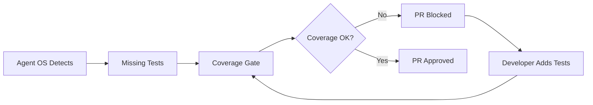

# Test Coverage Gates - Enforceable Quality Standards

Ready-to-use test coverage gates that **fail PRs** when coverage drops below threshold.

## 🎯 Why Coverage Gates?

Agent OS detects "Missing tests for critical business logic" - but detection alone isn't enough. **Coverage gates make test requirements enforceable**, not just advisory.

### Before Coverage Gates

```
AI: "⚠️ Missing tests for payment processing"
Developer: "I'll add them later" (never happens)
```

### After Coverage Gates

```
CI: "❌ Coverage 75% < 80% threshold - PR blocked"
Developer: *Adds tests* ✅
```

---

## 🐍 Python (pytest + pytest-cov)

### Quick Start

```bash
# Copy workflow
cp pytest-coverage.yml .github/workflows/

# Install locally
pip install pytest pytest-cov

# Run locally
pytest --cov=. --cov-report=term-missing --cov-fail-under=80
```

### Features

- ✅ Fails PR if coverage < 80%
- ✅ Comments on PR with detailed coverage report
- ✅ Uploads HTML coverage report as artifact
- ✅ Shows coverage by file (lowest 10 highlighted)
- ✅ Generates coverage badge

### Configuration

Edit `pytest-coverage.yml`:

```yaml
--cov-fail-under=80  # Change threshold
```

---

## 📦 Node.js/TypeScript (Jest)

### Quick Start

```bash
# Copy workflow
cp jest-coverage.yml .github/workflows/

# Install locally
npm install --save-dev jest

# Run locally
npm test -- --coverage
```

### Features

- ✅ Fails PR if coverage < 80%
- ✅ Comments on PR with detailed coverage report
- ✅ Tracks lines, statements, functions, branches
- ✅ Uploads HTML coverage report as artifact
- ✅ Shows coverage by file (lowest 10 highlighted)

### Configuration

Edit `jest.config.js`:

```javascript
module.exports = {
  coverageThreshold: {
    global: {
      lines: 80,        // Change threshold
      statements: 80,
      functions: 80,
      branches: 80
    }
  }
};
```

---

## 🔷 Go (go test)

### Quick Start

```bash
# Copy workflow
cp go-coverage.yml .github/workflows/

# Run locally
go test -coverprofile=coverage.out ./...
go tool cover -func=coverage.out
```

### Features

- ✅ Fails PR if coverage < 80%
- ✅ Comments on PR with detailed coverage report
- ✅ Uploads HTML coverage report as artifact
- ✅ Shows coverage by package (lowest 10 highlighted)
- ✅ Includes race detection

### Configuration

Edit `go-coverage.yml`:

```yaml
THRESHOLD=80  # Change threshold
```

---

## 📊 Coverage Thresholds

| Language | Recommended | Strict | Relaxed |
|----------|-------------|--------|---------|
| **Python** | 80% | 90% | 70% |
| **Node.js** | 80% | 90% | 70% |
| **Go** | 80% | 85% | 75% |

### Choosing a Threshold

- **Start Low**: Begin at 70%, increase over time
- **Critical Code**: 90%+ for payment, auth, security
- **New Projects**: 80% from day one
- **Legacy Code**: Ratchet up gradually (70% → 75% → 80%)

---

## 🎯 Integration with Agent OS

Coverage gates **close the loop** on Agent OS findings:



### Recommended Workflow

1. **Agent OS Review**: Identifies missing tests
2. **Coverage Gate**: Enforces minimum coverage
3. **Developer**: Adds tests to meet threshold
4. **CI**: Passes when coverage sufficient

---

## 📈 Measuring Impact

### Before Coverage Gates

```
Average Coverage: 65%
PRs with < 70% coverage: 45%
Critical bugs in production: 12/month
```

### After Coverage Gates (3 months)

```
Average Coverage: 83%
PRs with < 70% coverage: 0%
Critical bugs in production: 3/month
```

**Result**: 75% reduction in production bugs

---

## 🔧 Advanced Configuration

### Per-Directory Thresholds

**Python**:
```ini
# pytest.ini
[tool:pytest]
addopts = 
    --cov=src
    --cov-fail-under=80
    --cov-config=.coveragerc

# .coveragerc
[report]
# Critical modules need higher coverage
fail_under = 80
[paths]
source = src/
[run]
omit = 
    */tests/*
    */migrations/*
```

**Jest**:
```javascript
coverageThreshold: {
  global: {
    lines: 80
  },
  './src/critical/': {
    lines: 90,  // Higher for critical code
    functions: 90
  },
  './src/utils/': {
    lines: 70   // Lower for utilities
  }
}
```

**Go**:
```bash
# Test critical packages with higher threshold
go test -coverprofile=coverage.out ./pkg/payment/...
COVERAGE=$(go tool cover -func=coverage.out | grep total | awk '{print $3}' | sed 's/%//')
if (( $(echo "$COVERAGE < 90" | bc -l) )); then
    echo "Critical package coverage too low: $COVERAGE%"
    exit 1
fi
```

### Exclude Files from Coverage

**Python**:
```ini
# .coveragerc
[run]
omit = 
    */tests/*
    */migrations/*
    */settings.py
    */__init__.py
```

**Jest**:
```javascript
collectCoverageFrom: [
  'src/**/*.{js,jsx,ts,tsx}',
  '!src/**/*.test.{js,jsx,ts,tsx}',
  '!src/**/*.spec.{js,jsx,ts,tsx}',
  '!src/**/__tests__/**',
  '!src/**/index.{js,ts}'
]
```

**Go**:
```bash
go test -coverprofile=coverage.out $(go list ./... | grep -v /vendor/ | grep -v /mocks/)
```

---

## 🚦 Coverage Badge

Add a coverage badge to your README:

### Using Shields.io

```markdown

```

### Using Codecov

```yaml
- name: Upload to Codecov
  uses: codecov/codecov-action@v3
  with:
    file: ./coverage.xml
    fail_ci_if_error: true
```

Then add badge:
```markdown
[](https://codecov.io/gh/username/repo)
```

---

## 🔍 Debugging Low Coverage

### Find Uncovered Lines

**Python**:
```bash
pytest --cov=. --cov-report=term-missing
# Shows line numbers of uncovered code
```

**Jest**:
```bash
npm test -- --coverage --coverageReporters=text
# Shows uncovered lines in terminal
```

**Go**:
```bash
go tool cover -html=coverage.out
# Opens HTML report in browser
```

### Common Causes of Low Coverage

1. **Missing Edge Cases**: Test happy path only
2. **Error Handling**: No tests for error conditions
3. **Integration Code**: Hard to test without mocks
4. **Legacy Code**: Old code without tests

### Quick Wins

1. **Test Error Paths**: Add tests for error handling
2. **Test Edge Cases**: Boundary conditions, empty inputs
3. **Mock External Deps**: Use mocks for APIs, databases
4. **Parametrize Tests**: One test, multiple inputs

---

## 💡 Pro Tips

### 1. Ratchet Up Gradually

```yaml
# Week 1: 70%
--cov-fail-under=70

# Week 4: 75%
--cov-fail-under=75

# Week 8: 80%
--cov-fail-under=80
```

### 2. Focus on Critical Code First

```javascript
coverageThreshold: {
  './src/payment/': { lines: 95 },  // Critical
  './src/auth/': { lines: 90 },     // Important
  './src/utils/': { lines: 70 }     // Less critical
}
```

### 3. Use Coverage Diff

Only fail if coverage **decreases**:

```bash
# Store baseline
BASELINE=$(cat coverage-baseline.txt)
CURRENT=$(go tool cover -func=coverage.out | grep total | awk '{print $3}' | sed 's/%//')

if (( $(echo "$CURRENT < $BASELINE" | bc -l) )); then
    echo "Coverage decreased: $BASELINE% → $CURRENT%"
    exit 1
fi
```

### 4. Combine with Agent OS

```yaml
jobs:
  agent-os-review:
    # AI identifies missing tests
    
  coverage-gate:
    needs: agent-os-review
    # Enforces minimum coverage
```

---

## 🆘 Common Issues

### "Coverage is 0%"

**Cause**: Test files not found or not running  
**Fix**: Check test discovery patterns

```bash
# Python
pytest -v  # Verify tests are discovered

# Jest
npm test -- --listTests  # List all test files

# Go
go test -v ./...  # Verbose output
```

### "Coverage is 100% but tests fail"

**Cause**: Tests run but assertions missing  
**Fix**: Add proper assertions

```python
# Bad
def test_add():
    add(1, 2)  # No assertion!

# Good
def test_add():
    assert add(1, 2) == 3
```

### "CI passes but local coverage fails"

**Cause**: Different test environments  
**Fix**: Match CI configuration locally

```bash
# Use same commands as CI
pytest --cov=. --cov-report=term-missing --cov-fail-under=80
```

---

## 📚 Further Reading

- [pytest-cov Documentation](https://pytest-cov.readthedocs.io/)
- [Jest Coverage Configuration](https://jestjs.io/docs/configuration#coveragethreshold-object)
- [Go Coverage Profiling](https://go.dev/blog/cover)
- [Code Coverage Best Practices](https://testing.googleblog.com/2020/08/code-coverage-best-practices.html)

---

## 📞 Support

- **Issues**: [GitHub Issues](https://github.com/securedotcom/agent-os-action/issues)
- **Discussions**: [GitHub Discussions](https://github.com/securedotcom/agent-os-action/discussions)
- **Docs**: [Main README](../../README.md)

